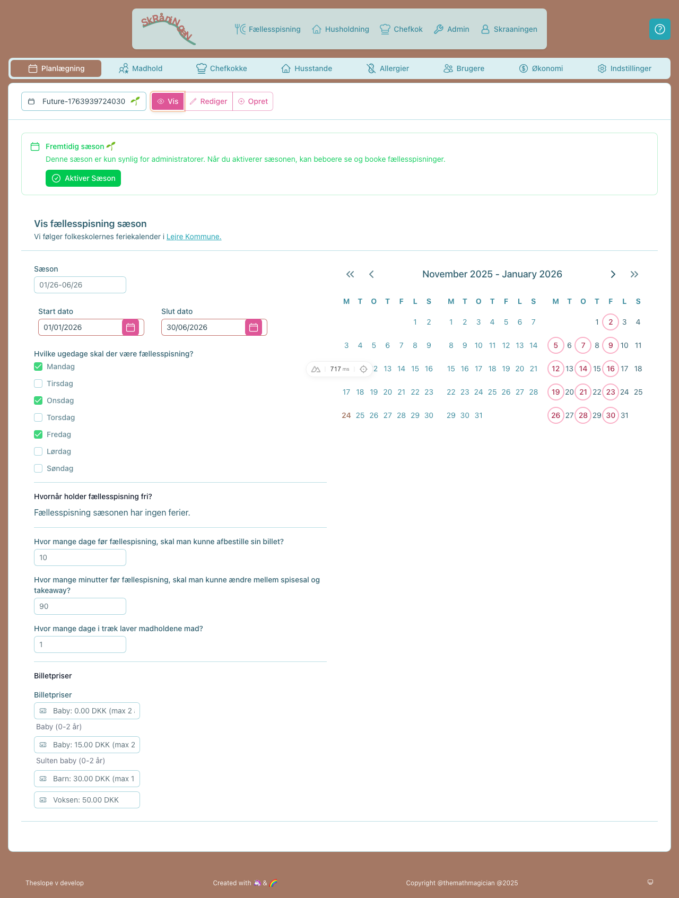

# Administratorguide

Denne guide dækker alle administrative opgaver i TheSlope. Du skal have **ADMIN**-rollen for at få adgang.

> **Se også:** [Brugerguide](user-guide.md) | [Chefkokguide](chef-guide.md) | [Systemoversigt](features.md)

---

## Hurtig oversigt

| Opgave | Hvor |
|--------|------|
| Opret ny sæson | `/admin/planning?mode=create` |
| Aktivér sæson | `/admin/planning` → Sæsonvælger |
| Administrer madhold | `/admin/teams` |
| Se husstande | `/admin/households` |
| Importér sæson fra CSV | `make theslope-import-season-*` |
| Synkronisér fra Heynabo | `make heynabo-import-*` |

---

## Sæsonstyring

### Sådan opretter du en ny sæson

1. Gå til `/admin/planning`
2. Klik på **Opret**-knappen
3. Udfyld:
   - **Sæsondatoer** - Start- og slutdato
   - **Madlavningsdage** - Hvilke ugedage der er fællesspisning (typisk man-tors)
   - **Ferier** - Perioder uden madlavning (skoleferier osv.)
   - **Billetpriser** - Priser for voksen, barn og baby
4. Klik **Gem**

Systemet opretter automatisk middagsbegivenheder for alle madlavningsdage i perioden.


### Sådan aktiverer du en sæson

Når du aktiverer en sæson, bliver den synlig for alle brugere, og automatiske tilmeldinger oprettes.

1. Gå til `/admin/planning`
2. Brug sæsonvælgeren til at finde sæsonen
3. Find sæsoner med 🌱 (fremtidig) status
4. Klik **Aktivér sæson**



**Hvad sker der ved aktivering:**
- Sæsonen bliver synlig for alle (🟢 status)
- Tilmeldinger oprettes ud fra beboernes præferencer
- Kun middage inden for 60 dage bliver booket
- Afmeldinger respekteres (systemet genskaber ikke afmeldte billetter)

### Sæsonstatusikoner

| Ikon | Status | Betydning |
|------|--------|-----------|
| 🟢 | Aktiv | Synlig for brugere, tilmeldinger aktive |
| 🌱 | Fremtidig | Kan aktiveres, datoer er i fremtiden |
| ⚪ | Afsluttet | Arkiveret, kan ikke genaktiveres |


---

## Madhold

### Sådan opretter du madhold

1. Gå til `/admin/teams?mode=create`
2. Vælg sæsonen i dropdown-menuen
3. Indtast antal hold du vil oprette
4. Klik **Opret madhold**

### Sådan redigerer du madhold

1. Gå til `/admin/teams?mode=edit`
2. Vælg et hold i venstre panel
3. Redigér holdnavn, madlavningsdage eller medlemmer
4. Ændringer gemmes automatisk


### Sådan tilføjer du holdmedlemmer

1. I redigeringstilstand, vælg et hold
2. Brug søgefeltet til at finde beboere
3. Klik på en rolle-knap (Chef, Kok, Kokkespire)

---

## Husstande

### Sådan ser du husstande

1. Gå til `/admin/households`
2. Brug søgefeltet til at filtrere på adresse eller navn


---

## Import og eksport

### Sæsonimport (CSV)

Importér sæsonkalender og holdtildelinger fra CSV-filer.

```bash
make theslope-import-season-prod   # Produktion
make theslope-import-season-local  # Lokal
```

**Placering af CSV-filer:** `.theslope/team-import/`

#### `calendar.csv` - Sæsonplan

```csv
date,weekday,team
11-08-2025,mandag,1
12-08-2025,tirsdag,1
13-10-2025,mandag,Efterårsferie
```

| Kolonne | Format | Beskrivelse |
|---------|--------|-------------|
| date | DD-MM-YYYY | Madlavningsdato |
| weekday | Dansk | mandag, tirsdag, onsdag, torsdag |
| team | Nummer eller tekst | Holdnummer (1-8) eller ferienavn |

Ferienavne: `Efterårsferie`, `Juleferie`, `Vinterferie`, `Påskeferie`, `Kr. Himmelfart`, `Pinse`, `FRIT`

#### `teams.csv` - Holdtildelinger

```csv
team,role,name,affinity
Madhold 1,CHEF,Maria,
Madhold 1,COOK,Søren L.,man
Madhold 1,JUNIORHELPER,Asta G.,man
```

#### Navnematching

| Format | Eksempel | Matcher |
|--------|----------|---------|
| Kun fornavn | `Maria` | Unikt fornavn |
| Fornavn + initial | `Søren L.` | Fornavn + efternavn der starter med L |
| Fornavn + flere initialer | `Mads B.H.` | Fornavn + efternavn "Bruun Hovgaard" |

Tjek `unmatchedNames` i svaret - disse skal tildeles manuelt eller rettes i CSV.

### Heynabo-import

Synkronisér husstande og beboere fra Heynabo:

```bash
make heynabo-import-prod   # Produktion
make heynabo-import-local  # Lokal
```

---

## Økonomi

### Faktureringsperioder

Fakturering kører automatisk den 17. hver måned:
- **Forbrugsperiode**: 18. forrige måned → 17. denne måned
- **PBS-opkrævning**: 1. i efterfølgende måned

### Sådan deler du fakturaoplysninger med revisor

1. Gå til `/admin/economy`
2. Vælg en faktureringsperiode
3. Klik **Del** for at generere et magic link
4. Send linket til revisor (kræver ikke login)

---

## Systemvedligeholdelse

### Systemjobs (`/admin/system`)

| Job | Kørsel | Beskrivelse |
|-----|--------|-------------|
| Daglig vedligeholdelse | Kl. 02:00 | Afslut middage, luk ordrer, opret transaktioner, tilmeldinger (rolling window 60 dage) |
| Månedlig fakturering | 17. kl. 04:00 | Generer fakturaer for perioden |
| Heynabo import | Kl. 03:00 | Synkroniser husstande fra Heynabo |

### Sådan kører du et job manuelt

1. Gå til `/admin/system`
2. Find jobbet i oversigten
3. Klik **Kør nu**
4. Se resultat i jobhistorikken nedenfor

Alle jobs er idempotente og kan køres igen uden problemer.

---

## FAQ

*Spørgsmål tilføjes løbende baseret på brugerhenvendelser.*

---

*Sidst opdateret: December 2025*
