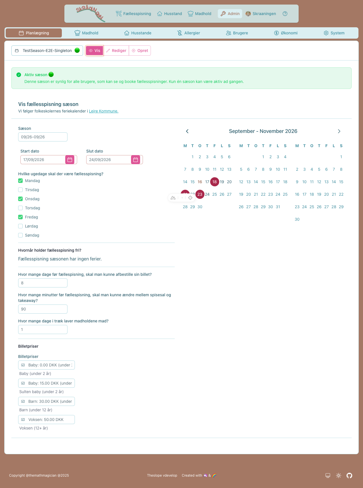
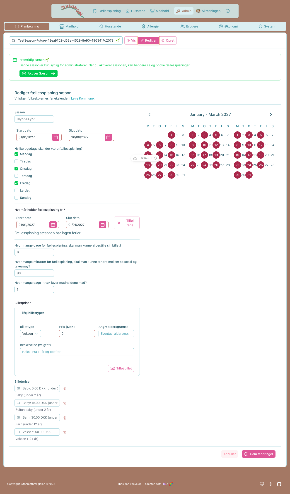
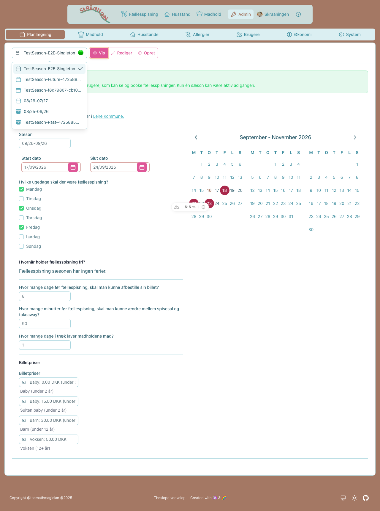
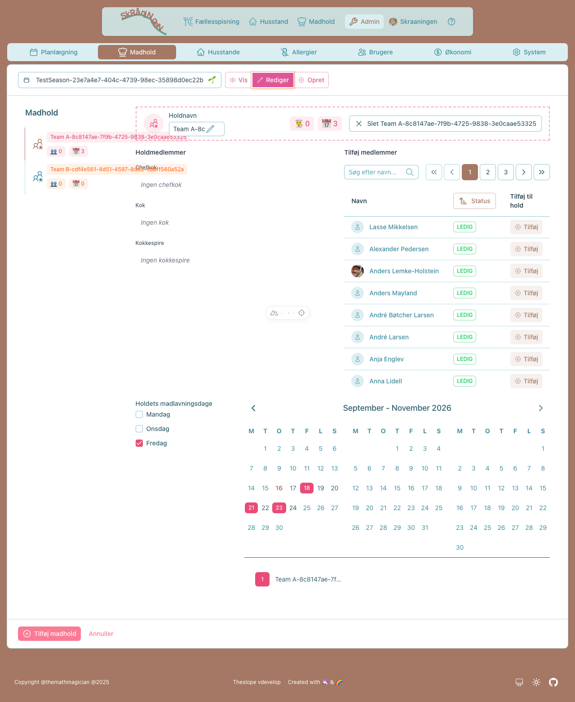
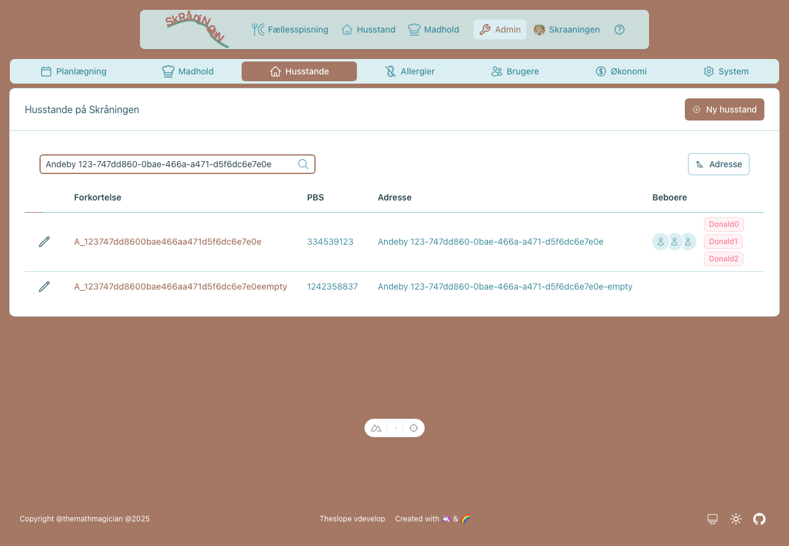

# Administratorguide

Denne guide dækker alle administrative opgaver i TheSlope. Du skal have **ADMIN**-rollen for at redigere.

> **Se også:** [Brugerguide](user-guide.md) | [Chefkokguide](chef-guide.md) | [Systemoversigt](features.md)

---

## Adgangskontrol

Admin-siden er tilgængelig for alle brugere, men **kun admin kan redigere**:

| Rolle | Kan se | Kan redigere |
|-------|--------|--------------|
| Admin | ✅ Alle faner | ✅ Alle faner |
| Allergi-ansvarlig | ✅ Alle faner | ✅ Kun Allergier |
| Almindelig bruger | ✅ Alle faner | ❌ Ingen |

Ikke-admin ser en **"Se, men ikke røre"**-besked og kan ikke ændre data:


---

## Faner i administrationssiden

| Fane | Formål | Kræver rolle |
|------|--------|--------------|
| **Planlægning** | Opret og administrer sæsoner, ferier, priser | Admin |
| **Madhold** | Opret hold, tildel medlemmer og madlavningsdage | Admin |
| **Husstande** | Se husstande, flyt beboere ved flere husstande på samme adresse, slet husstande | Admin |
| **Allergier** | Administrer allergi-katalog | Admin eller Allergi-ansvarlig |
| **Brugere** | Se brugere, tildel systemroller | Admin |
| **Økonomi** | Se fakturaer og økonomioversigt | (kun visning) |
| **System** | Kør systemjobs, se jobhistorik | Admin |

---

## Hurtig oversigt

| Opgave | Hvor |
|--------|------|
| Opret ny sæson | [Planlægning → Opret](https://www.skraaningen.dk/admin/planning?mode=create) |
| Aktivér sæson | [Planlægning](https://www.skraaningen.dk/admin/planning) → Sæsonvælger |
| Administrer madhold | [Madhold](https://www.skraaningen.dk/admin/teams) |
| Redigér husstande / flyt beboere | [Husstande](https://www.skraaningen.dk/admin/households) |
| Administrer allergityper | [Allergier](https://www.skraaningen.dk/admin/allergies) |
| Se brugere og roller | [Brugere](https://www.skraaningen.dk/admin/users) |
| Se økonomioversigt | [Økonomi](https://www.skraaningen.dk/admin/economy) |
| **Ret bookinger (admin)** | [Økonomi](https://www.skraaningen.dk/admin/economy) → Fremtidige bestillinger |
| Kør systemjobs | [System](https://www.skraaningen.dk/admin/system) |
| Importér sæson fra CSV | `make theslope-import-season-*` |
| Synkronisér fra Heynabo | `make heynabo-import-*` |

---

## Sæsonstyring

### Sådan opretter du en ny sæson

1. Gå til [Planlægning](https://www.skraaningen.dk/admin/planning)
2. Klik på **Opret**-knappen
3. Udfyld:
   - **Sæsondatoer** - Start- og slutdato
   - **Madlavningsdage** - Hvilke ugedage der er fællesspisning (typisk man-tors)
   - **Ferier** - Perioder uden madlavning (skoleferier osv.)
   - **Billetpriser** - Priser for voksen, barn og baby
4. Klik **Gem**

Systemet opretter automatisk middagsbegivenheder for alle madlavningsdage i perioden.



### Sådan aktiverer du en sæson

Når du aktiverer en sæson, bliver den synlig for alle brugere, og automatiske tilmeldinger oprettes.

1. Gå til [Planlægning](https://www.skraaningen.dk/admin/planning)
2. Brug sæsonvælgeren til at finde sæsonen
3. Find sæsoner med 🌱 (fremtidig) status
4. Klik **Aktivér sæson**



**Hvad sker der ved aktivering:**
- Sæsonen bliver synlig for alle (🟢 status)
- Tilmeldinger oprettes ud fra beboernes præferencer
- Kun middage inden for 60 dage bliver booket
- Afmeldinger respekteres (systemet genskaber ikke afmeldte billetter)

### Sæsonstatusikoner

| Ikon | Status | Betydning |
|------|--------|-----------|
| 🟢 | Aktiv | Synlig for brugere, tilmeldinger aktive |
| 🌱 | Fremtidig | Kan aktiveres, datoer er i fremtiden |
| ⚪ | Afsluttet | Arkiveret, kan ikke genaktiveres |



---

## Madhold

### Sådan opretter du madhold

1. Gå til [Madhold → Opret](https://www.skraaningen.dk/admin/teams?mode=create)
2. Vælg sæsonen i dropdown-menuen
3. Indtast antal hold du vil oprette
4. Klik **Opret madhold**

### Sådan redigerer du madhold

1. Gå til [Madhold → Redigér](https://www.skraaningen.dk/admin/teams?mode=edit)
2. Vælg et hold i venstre panel
3. Redigér holdnavn, madlavningsdage eller medlemmer
4. Ændringer gemmes automatisk



### Sådan tilføjer du holdmedlemmer

1. I redigeringstilstand, vælg et hold
2. Brug søgefeltet til at finde beboere
3. Klik **Tilføj** — formularen åbner under rækken
4. Vælg rolle, arbejdstid og eventuelle ugedage
5. Klik **Tilføj**

Beboere kan være medlem af flere hold. Klik **Rediger** for at ændre rolle, arbejdstid eller ugedage for et eksisterende medlem.

---

## Husstande

### Sådan ser du husstande

1. Gå til [Husstande](https://www.skraaningen.dk/admin/households)
2. Brug søgefeltet til at filtrere på adresse eller navn



### Sådan redigerer du en husstand

1. Gå til [Husstande](https://www.skraaningen.dk/admin/households)
2. Klik på blyant-ikonet ud for husstanden
3. Panelet viser stamdata (PBS, adresse, Heynabo-ID) og residensstatus

### Sådan flytter du en beboer

Beboere kan flyttes mellem husstande på **samme adresse** (samme Heynabo-ID). Dette bruges f.eks. når en ny husstand oprettes ved fraflytning, og en beboer skal tilknyttes den nye husstand.

1. Åbn redigeringspanelet for mål-husstanden
2. Find beboeren i listen (viser kun beboere på samme adresse)
3. Klik **Flyt hertil**
4. Systemet opdaterer tilknytningen og genberegner bookinger

> **Bemærk:** Heynabo-import forsøger at gætte hvilken husstand nye beboere tilhører, men nogen gange skal dette korrigeres af admin. Heynabo-import respekterer admin-flytninger.

### Admin-adgang til husstandssider

Admin kan besøge enhver husstands side og aktivere admin-tilgang:

1. Gå til en husstand via linket i husstandstabellen
2. Klik **Aktivér admin-adgang** på banneret "Du besøger en anden husstand"
3. Nu kan du ændre på vegne af beboerne:
   - **Præferencer** — ændre madpræferencer (genberegner bookinger)
   - **Fraflytningsdato** — sætte eller fjerne fraflytningsdato (genberegner bookinger)
   - **Bookinger** — rette tilmeldinger også efter deadline er passeret

### Sådan sletter du en husstand

1. Åbn redigeringspanelet for husstanden
2. Flyt eventuelle beboere til en anden husstand først
3. Klik **Slet** nederst (to-klik bekræftelse)

---

## Allergityper

Admin og allergi-ansvarlige kan redigere allergi-kataloget.

### Sådan opretter du en allergitype

1. Gå til [Allergier](https://www.skraaningen.dk/admin/allergies)
2. Klik **Opret**
3. Udfyld navn, beskrivelse og ikon (emoji)
4. Klik **Gem**

### Sådan ser du hvem der har en allergi

1. Gå til [Allergier](https://www.skraaningen.dk/admin/allergies)
2. Klik på en allergitype i listen
3. Se alle beboere med denne allergi og deres kommentarer

### Multiselekt-tilstand

1. Slå "Vælg flere allergier" til
2. Marker de allergityper du vil se
3. Se samlet antal påvirkede beboere
4. Brug til menuoverblik (f.eks. "Ingen nødder i dag")

> **Bemærk:** Sletning af en allergitype fjerner automatisk alle registreringer for den type (CASCADE).

---

## Brugere

Brugerfanen viser alle brugere importeret fra Heynabo.

### Sådan ser du brugere

1. Gå til [Brugere](https://www.skraaningen.dk/admin/users)
2. Brug søgefeltet til at finde brugere på navn eller email
3. Klik på pilen ved en bruger for at se detaljer

### Systemroller

Admin kan tildele systemroller til brugere:

| Rolle | Beskrivelse | Tildeles af |
|-------|-------------|-------------|
| **ADMIN** | Fuld adgang til alle administrative funktioner | Heynabo (via Bestyrelse-rolle) |
| **ALLERGYMANAGER** | Kan redigere allergi-kataloget | Admin i TheSlope |

### Sådan tildeler du Allergi-ansvarlig rollen

1. Gå til [Brugere](https://www.skraaningen.dk/admin/users)
2. Find brugeren og klik på pilen for at udvide
3. Under "Systemroller", slå "Allergi-ansvarlig" til
4. Ændringen gemmes automatisk

> **Bemærk:** ADMIN-rollen styres af Heynabo og kan ikke ændres i TheSlope.

---

## Import og eksport

### Sæsonimport (CSV)

Importér sæsonkalender og holdtildelinger fra CSV-filer.

```bash
make theslope-import-season-prod   # Produktion
make theslope-import-season-local  # Lokal
```

**Placering af CSV-filer:** `.theslope/team-import/`

#### `calendar.csv` - Sæsonplan

```csv
date,weekday,team
11-08-2025,mandag,1
12-08-2025,tirsdag,1
13-10-2025,mandag,Efterårsferie
```

| Kolonne | Format | Beskrivelse |
|---------|--------|-------------|
| date | DD-MM-YYYY | Madlavningsdato |
| weekday | Dansk | mandag, tirsdag, onsdag, torsdag |
| team | Nummer eller tekst | Holdnummer (1-8) eller ferienavn |

Ferienavne: `Efterårsferie`, `Juleferie`, `Vinterferie`, `Påskeferie`, `Kr. Himmelfart`, `Pinse`, `FRIT`

#### `teams.csv` - Holdtildelinger

```csv
team,role,name,affinity
Madhold 1,CHEF,Maria,
Madhold 1,COOK,Søren L.,man
Madhold 1,JUNIORHELPER,Asta G.,man
```

#### Navnematching

| Format | Eksempel | Matcher |
|--------|----------|---------|
| Kun fornavn | `Maria` | Unikt fornavn |
| Fornavn + initial | `Søren L.` | Fornavn + efternavn der starter med L |
| Fornavn + flere initialer | `Mads B.H.` | Fornavn + efternavn "Bruun Hovgaard" |

Tjek `unmatchedNames` i svaret - disse skal tildeles manuelt eller rettes i CSV.

### Heynabo-import

Synkronisér husstande og beboere fra Heynabo:

```bash
make heynabo-import-prod   # Produktion
make heynabo-import-local  # Lokal
```

---

## Økonomi

### Faktureringsperioder

Fakturering kører automatisk den 17. hver måned:
- **Forbrugsperiode**: 18. forrige måned → 17. denne måned
- **PBS-opkrævning**: 1. i efterfølgende måned

### Sådan deler du fakturaoplysninger med revisor

1. Gå til [Økonomi](https://www.skraaningen.dk/admin/economy)
2. Vælg en faktureringsperiode
3. Klik **Del** for at generere et magic link
4. Send linket til revisor (kræver ikke login)

### Sådan retter du bookinger (Admin-korrektioner)

Som admin kan du rette bookinger for alle husstande - også efter deadline er passeret.

**Hvornår bruges dette:**
- Beboer glemte at tilmelde sig
- Forkert booking opdaget efter deadline
- Beboer misforstod præferencer

**Sådan gør du:**

1. Gå til [Økonomi](https://www.skraaningen.dk/admin/economy)
2. Find middagen under **Fremtidige bestillinger**
3. Klik på **Ret** (blyant-ikon) ud for den middag du vil rette
4. Vælg husstand i dropdown-menuen
5. Redigér tilmeldinger:
   - Tilføj/fjern personer
   - Ændr spisningsform (Spisesal, Sen, Takeaway)
   - Tilføj/fjern gæster
6. Se **forhåndsvisning** af ændringer
7. Klik **Gem ændringer**

**Admin-rettelser omgår:**
- Tilmeldingsdeadline (10 dage)
- Afmeldingsregler (slet i stedet for frigiv)

> **Bemærk:** Admin-rettelser logges med dit bruger-ID i systemets audit trail.

> **Vigtigt:** Rettelser til lukkede ordrer (efter middagen er afholdt) understøttes ikke endnu.

---

## Systemvedligeholdelse

### [Systemjobs](https://www.skraaningen.dk/admin/system)

| Job | Kørsel | Beskrivelse |
|-----|--------|-------------|
| Daglig vedligeholdelse | Kl. 02:00 | Afslut middage, luk ordrer, opret transaktioner, tilmeldinger (rolling window 60 dage) |
| Månedlig fakturering | 17. kl. 04:00 | Generer fakturaer for perioden |
| Heynabo import | Kl. 03:00 | Synkroniser husstande fra Heynabo |

### Sådan kører du et job manuelt

1. Gå til [System](https://www.skraaningen.dk/admin/system)
2. Find jobbet i oversigten
3. Klik **Kør nu**
4. Se resultat i jobhistorikken nedenfor

Alle jobs er idempotente og kan køres igen uden problemer.

---

## FAQ

*Spørgsmål tilføjes løbende baseret på brugerhenvendelser.*

---

*Sidst opdateret: April 2026 (tilføjet husstandsredigering, beboerflytning, holdmedlemsformular)*
