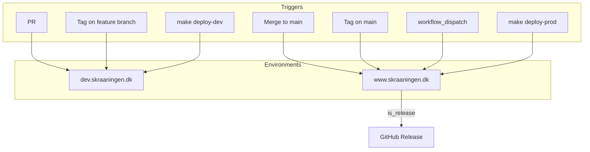

# Bugfix: CI/CD Release Flow

**Status:** Planned
**Date:** 2026-01-21

---

## Problem

1. Tag push deploys to dev instead of prod
2. `create-release` job fails if tag/release already exists
3. Ops guide missing deploy vs release procedures

---

## Routing Table

| Trigger | Condition | Target | Version | Example |
|---------|-----------|--------|---------|---------|
| PR | branch ≠ main | dev | Auto RC | `0.8.1-rc.5+abc123` |
| Push to main | branch = main | prod | Auto RC | `0.8.1-rc.5+abc123` |
| Tag push | commit on main | prod | From tag | `0.9.0+abc123` |
| Tag push | commit NOT on main | dev | From tag | `0.9.0+abc123` |
| workflow_dispatch + version | runs on main | prod | From input | `0.9.0+abc123` |
| workflow_dispatch (empty) | runs on main | prod | Auto RC | `0.8.1-rc.6+abc123` |
| `make deploy-dev` | local | dev | Auto RC | `0.8.1-rc.5+abc123` |
| `make deploy-prod` | local | prod | Auto RC or provided | `0.9.0+abc123` |

**Rule:** Only code from main branch reaches prod.

---

## Flow



---

## Fixes

| # | Task | Location | Strategy |
|---|------|----------|----------|
| 1 | Fix deployment target | cicd.yml "Determine deployment target" | Add check: tag commit on main → prod, else dev |
| 2 | Make release idempotent | cicd.yml "create-release" job | Check tag/release exists before create, skip if exists |
| 3 | Add `deployed_env == 'prod'` condition | cicd.yml "create-release" job | Only create releases for prod deploys |
| 4 | Update ops guide | docs/ops-runbook.md | Add deploy vs release procedures |

---

## Operator Guidelines

### Deploy vs Release

| Action | What | When | Command |
|--------|------|------|---------|
| **Deploy** | Ship code | Every PR merge | `gh pr merge` |
| **Release** | Mark version | Business decision | Tag push or UI dispatch |

### Release Methods

| Method | Command |
|--------|---------|
| CLI (GitOps) | `git tag v0.9.0 && git push origin v0.9.0` |
| UI | Actions → Run workflow → enter version |
| Local (emergency) | `RELEASE_VERSION=0.9.0 make deploy-prod` |

### Verify

```bash
curl -s https://www.skraaningen.dk/api/public/health | jq '.version'
```

---

## Implementation

1. Create branch `fix/cicd-release-routing`
2. Apply fixes 1-3 to cicd.yml
3. Update ops-runbook.md
4. Test all trigger scenarios
5. Merge and release v0.9.0
