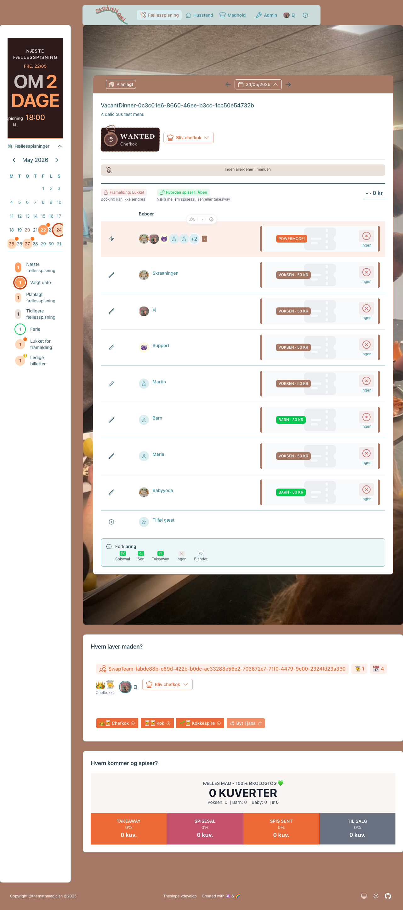
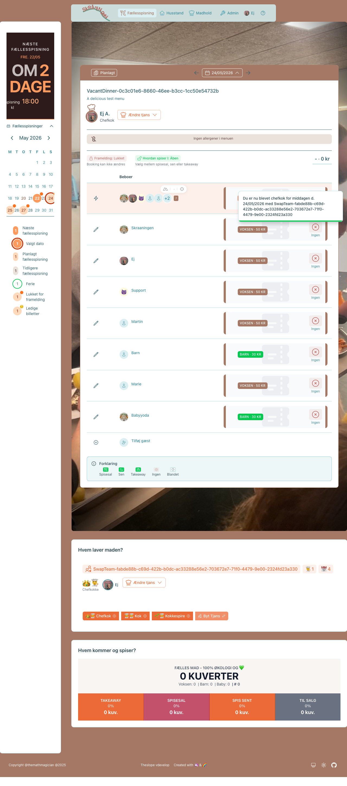

# Chefkokguide

Denne guide er til dig, der er chefkok på et madhold.

> **Se også:** [Brugerguide](user-guide.md) | [Administratorguide](admin-guide.md) | [Systemoversigt](features.md)

---

## Dine deadlines

| Deadline | Hvornår | Hvad skal du gøre? |
|----------|---------|-------------------|
| **Annoncering** | 10 dage før | Menu skal være publiceret så beboere kan tilmelde sig |
| **Indkøb** | 3 dage før | Indkøbsliste skal være klar |

På [Chef-siden](https://www.skraaningen.dk/chef) vises farvede badges:
- 🟢 **Grøn** - God tid
- 🟡 **Gul** - Deadline nærmer sig
- 🔴 **Rød** - Deadline overskredet

---

## Trin for trin

### 1. Bliv chefkok

Kokkehuen hopper ikke selv op på hovedet. Når du har aftalt med dit madhold — eller de andre chefkokke — at du tager tjansen en bestemt dag, melder du dig som chefkok i appen.

Mangler en middag en chefkok, lyser portrættet med et stort **WANTED**, som en eftersøgt fra det vilde vesten. Du finder middagene to steder:

- **Middagskalenderen** ([dinner](https://www.skraaningen.dk/dinner)) — viser alle middage
- **Chefsiden** ([chef](https://www.skraaningen.dk/chef)) — viser middagene for de madhold du selv er på

Klik **Bliv chefkok**, bekræft — og dit ansigt pryder portrættet. Tjansen er din.

*WANTED — denne middag mangler en helt*

*Tjansen er landet — nu er det dig der svinger grydeskeen*

> **Fortrød du?** Klik **Ændre tjans** på portrættet og vælg **Meld afbud** (to klik — vi vil være helt sikre). Tjansen bliver ledig igen, WANTED-skiltet popper op, og din menu nulstilles til den næste helt.
>
> **På vej:** Snart kan du *bytte tjans* direkte med en anden kok — så slipper I for at lede efter en afløser.

---

### 2. Planlæg din menu

1. Gå til [Chef](https://www.skraaningen.dk/chef)
2. Klik på den middag du er chefkok for
3. Udfyld **Menutitel** (kort beskrivelse af retten)
4. Udfyld **Menubeskrivelse** (detaljer om maden)
5. Gem ændringer

---

### 3. Angiv allergener

1. På samme side, find sektionen **Allergener**
2. Marker hvilke allergener din menu indeholder (f.eks. gluten, nødder, mælk)
3. Systemet viser automatisk hvilke tilmeldte gæster der er berørt
4. Tilpas menuen eller forbered alternativer til berørte gæster

---

### 4. Publicer til Heynabo

⏰ *Deadline: 10 dage før middagen*

1. Når din menu er klar, klik på **Publicer**
2. Menuen overføres automatisk til Heynabo-kalenderen
3. Beboere kan nu se menuen i Heynabo-appen

> **Bemærk:** Hvis du ændrer menuen senere, synkroniseres ændringerne automatisk til Heynabo.

---

### 5. Tjek tilmeldinger

1. Gå til din middag på [Chef](https://www.skraaningen.dk/chef)
2. Se **køkkenpanelet** med overblik over tilmeldinger:

**Køkkenpanelet viser:**

| Kategori | Indhold |
|----------|---------|
| **Total kuverter** | Samlet antal portioner (voksen, barn, baby) |
| **Takeaway** | Antal og procentdel der henter mad |
| **Spisesal** | Antal og procentdel der spiser i salen |
| **Sen spisning** | Antal og procentdel der kommer sent |
| **Til salg** | Frigivne billetter der kan overtages |

**Klik på en kategori** for at se detaljeret opdeling:
- Hvilke husstande der har tilmeldt sig
- Hvem der har allergier (markeret med emoji)
- Billettyper per husstand (voksen/barn/baby)

> **Tip:** Brug husstandsoversigten til at planlægge portionsstørrelser og allergihensyn.

---

### 6. Indkøb

⏰ *Deadline: 3 dage før middagen*

1. Brug tilmeldingsoversigten til at planlægge mængder
2. Husk at tage højde for allergier

---

### 7. På madlavningsdagen

1. Tjek tilmeldinger en sidste gang for eventuelle ændringer
2. Afbud efter deadline vises i oversigten - beboeren betaler stadig

---

## Aflysning

Hvis middagen ikke kan afholdes:

1. Gå til middagen på [Chef](https://www.skraaningen.dk/chef)
2. Klik **Aflys** - knappen skifter farve og viser "Tryk igen for at aflyse..."
3. Klik igen inden for 3 sekunder for at bekræfte

**Hvad sker der:**
- Middagen markeres som AFLYST
- Beboerne får deres penge tilbage
- Heynabo opdateres automatisk

**Fortryd aflysning:** Klik **Annuller aflysning** og bekræft med endnu et klik.

---

## Dit madhold

| Rolle | Ansvar |
|-------|--------|
| **Chefkok** | Planlægger menu, handler ind, leder køkkenet |
| **Kok** | Hjælper med tilberedning |
| **Kokkespire** | Lærer at lave mad, lettere opgaver |

Se dine holdmedlemmer på [Chef](https://www.skraaningen.dk/chef).

---

*Sidst opdateret: Maj 2026 (enhver kan blive chefkok / meld afbud direkte på portrættet)*
