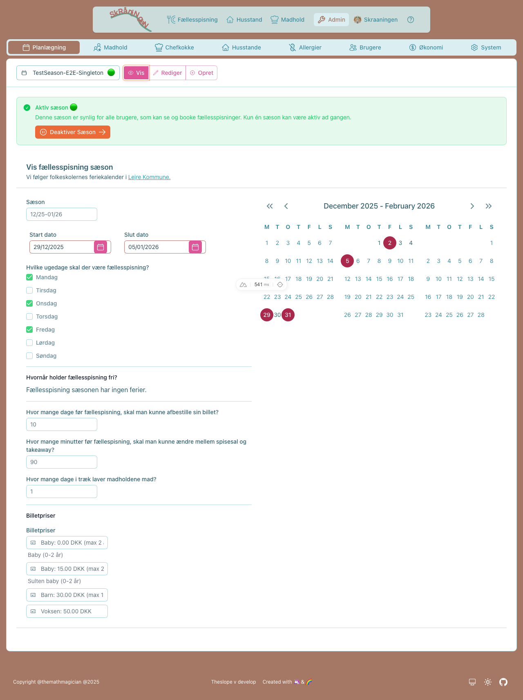

# Purpose

Solve problems with signing up for meals, and paying for them

# Features

## User roles
- 👩‍🍳Chef  - responsible for menu of dinner event, managing cooking team, shopping, cooking
- 🤖Admin - rsponsible for creating dinner events (according to school plan in Lejre)
- 😋Skråner - participates in cooking teams, and consumes meals together with the household, has a list of allergies

## Data model
- Dinner event
- Meal ticket - has type (regular, child, guest), venue (dining hall, take away),  household, date and is linked to a dinner event
- Household - has a pbs number, adress, associated users (skråner), and a list of household members - integrated from Heynabo 🤖

## Functionality
### Admin

#### Dining Season Management
- **Create dining season** with auto-generated dinner events
  - Define cooking days (weekdays selection)
  - Set holiday periods (excluded from event generation)
  - Automatic event generation based on season dates
  - Calendar visualization of generated events
- **Activate seasons** - control which season is visible to users
  - Visual status indicators show season state (active/future/past)
  - One-click activation for eligible seasons
  - Past seasons automatically archived (cannot be reactivated)
  - Smart sorting: active → future → past

**Season Selector with Status:**
```
┌─────────────────────────────────┐
│ 📅 Forår 2025            🟢 ▼ │  ← Selected (active season)
│ ─────────────────────────────── │
│ 📅 Forår 2025            🟢    │  ← ACTIVE - visible to all
│ 📅 Efterår 2025          🌱    │  ← FUTURE - can activate
│ 📅 Vinter 2025           🟡    │  ← CURRENT - dates match now
│ 📦 Efterår 2024          ⚪    │  ← PAST - archived
└─────────────────────────────────┘

Legend: 🟢 Active | 🌱 Future | 🟡 Current | ⚪ Past
```

**Actual Interface:**


*Season selector showing all seasons with color-coded status indicators*


*Active season alert - shown in VIEW and EDIT modes*


*Future season with activation button - make it visible to users with one click*

- **Manage cooking teams** with master-detail interface
  - Create multiple teams in batch
  - Edit team names (immediate save on blur)
  - Add/remove teams (immediate save)
  - Assign members to teams with roles (Chef, Cook, Junior Helper)
  - Visual member count badges
  - Color-coded team identification

**Team Management Interface:**
```
┌─────────────────┬────────────────────────────────────────────────┐
│ TEAMS (Left)    │ EDIT TEAM (Right)                              │
│                 │                                                │
│ □ Hold 1 [8]    │ 🍳 [Hold 2___________] 👤👤👤 [6 medlemmer]  │
│ ■ Hold 2 [6]    │                                                │
│ □ Hold 3 [0]    │ ┌Madlavningsdage─┬─Holdkalender──────────────┐ │
│ □ Hold 4 [5]    │ │☑ Mon  ☐ Fri    │ Oct  Nov  Dec             │ │
│ ...             │ │☑ Wed  ☐ Sat    │ 🔵1 🔵8  🔵15 🔵5  🔵12   │ │
│                 │ │☐ Thu  ☐ Sun    │ 🔵3 🔵10 ...              │ │
│                 │ └────────────────┴───────────────────────────┘ │
│                 │                                                │
│                 │ Holdmedlemmer                                  │
│                 │ ┌Chefkok────┬Kok─────────┬Kokkespire─────────┐ │
│                 │ │👤 Anna    │👤 Bob      │👤 Charlie        │ │
│                 │ │           │👤 Diana    │                   │ │
│                 │ └───────────┴────────────┴───────────────────┘ │
│                 │                                                │
│                 │ Tilføj medlemmer                               │
│                 │ [Søg...___________]                            │
│                 │ □ Emma (LEDIG)      [Chef][Kok][Spire]        │
│                 │ □ Frank (LEDIG)     [Chef][Kok][Spire]        │
│                 │ ☑ Anna (Madhold 2)  [Fjern]                   │
└─────────────────┴────────────────────────────────────────────────┘
```
- Pick a team from the left, edit it on the right
- Set which days they prefer to cook - system uses this for fair rotation
- See the whole season in a color-coded calendar (blue badges = this team's cooking days)
- Add or remove team members with a quick search
- Everyone saves automatically - no save buttons needed

#### Navigation & URL Management
- **Clean, bookmarkable URLs** for all admin sections (`/admin/planning`, `/admin/users`, etc.)
- **Form modes in URL** (view/edit/create) - share links to specific admin states
- **Browser navigation works** - use back/forward buttons to navigate between forms
- **Auto-save without page reload** - changes save immediately without losing your place

#### Household Management
- View all households with inhabitants
- Compact display with avatar groups
- Create new household for families that move to Skråningen
- Disable household for families that have left Skråningen

#### Billing Import
- **Import orders from CSV** (framelding format from legacy system)
  - Address-based household matching via `shortName`
  - Creates ADULT/CHILD tickets for active season's dinner events
  - `make heynabo-import-{local,dev,prod}` targets

#### Future Features
- Assign chef for dinner event
- Monthly overview of meal tickets sold
- Monthly report in cvs format for invoicing
- Send monthly report to pbs system
- Store monthly report in blob archive
- Upgrade baby to child meal ticket type
- Upgrade child to adult meal ticket type

### Chef
#### Planning menu
- Create menu / edit menu
- See budget based on meal ticket quantity
- See kitchen team
- see allergies

#### Heynabo Event Sync
- **Announce menu** syncs dinner event to Heynabo calendar
  - Creates Heynabo event with menu title, description, booking link
  - Uploads default dinner picture (random rotation)
  - Updates existing Heynabo event on menu changes
- **Cancel dinner** marks Heynabo event as cancelled

#### Cooking menu
- See number of dining guests
- see split for dining hall / take away - numbers and perentages
- see cancellations
- see allergies 

### Skråner

#### Weekly Dinner Preferences
- **Set weekly preferences** for each household member
  - Choose DINE IN, DINE IN LATE, TAKEAWAY, or NONE for each weekday
  - Auto-calculated ticket types based on age (Baby, Child, Adult)
  - Toggle between VIEW/EDIT mode with pencil icon
  - Changes save immediately without page reload
  - **⚡ Power Mode**: Update all family members at once with a single click

**VIEW Mode:**
- Compact icon badges show current preference for each day
- Read-only display - click pencil icon to edit
- Info-highlighted power row at top for whole-family editing

**EDIT Mode:**
- Button groups for each day with all 4 options visible
- Click any button to select that preference
- Active selection highlighted with color
- Changes save instantly

**Power Mode (⚡):**
- Edit the entire family's preferences in one go
- Click the ⚡ icon on the "Alle medlemmer" (All members) row
- Warning alert shows how many people will be affected
- Mixed preferences show as default (DINE IN) in the editor
- Save applies the same preferences to all household members
- Perfect for setting up a new household or changing family routines

**Interface (ASCII):**
```
┌─────────────────────────────────────────────────────────────────────────┐
│ UCARD                                                                   │
│ ┌─────────────────────────────────────────────────────────────────────┐ │
│ │ HEADER: Husstandens ugentlige booking præferencer                   │ │
│ └─────────────────────────────────────────────────────────────────────┘ │
│ ┌─────────────────────────────────────────────────────────────────────┐ │
│ │ BODY                                                                │ │
│ │                                                                     │ │
│ │ UTable - Inhabitants with expandable rows                          │ │
│ │ ┌───────────────────────────────────────────────────────────────┐  │ │
│ │ │ [⚡] Powermode! 👥👥👥 Alle medlemmer  🍽️ 🍽️ 🍽️ 🍽️ 🛍️   │  │ │  ← Power mode
│ │ ├───────────────────────────────────────────────────────────────┤  │ │
│ │ │ [✏️] Voksen  👤 Anna      🍽️ 🍽️ 🍽️ 🍽️ 🛍️   ← collapsed      │  │ │
│ │ ├───────────────────────────────────────────────────────────────┤  │ │
│ │ │ [✏️] Voksen  👤 Bob      🍽️ 🍽️ ❌ 🍽️ 🛍️   ← collapsed      │  │ │
│ │ ├───────────────────────────────────────────────────────────────┤  │ │
│ │ │ [✏️] Barn    👤 Clara    🍽️ 🍽️ 🍽️ 🍽️ 🛍️   ← collapsed      │  │ │
│ │ ├───────────────────────────────────────────────────────────────┤  │ │
│ │ │ [✏️] Baby    👤 David    ❌ ❌ ❌ ❌ ❌       ← collapsed      │  │ │
│ │ └───────────────────────────────────────────────────────────────┘  │ │
│ └─────────────────────────────────────────────────────────────────────┘ │
└─────────────────────────────────────────────────────────────────────────┘

EXPANDED (regular member):
┌───────────────────────────────────────────────────────────────┐
│ [▼] Voksen  👤 Anna                                          │
│ ──────────────────────────────────────────────────────────── │
│  EXPANDED:                                                   │
│  Mon: [🍽️ Spis][🕐 Sen][🛍️ Take][❌ Ingen]   ← button groups │
│  Tue: [🍽️ Spis][🕐 Sen][🛍️ Take][❌ Ingen]                 │
│  Wed: [🍽️ Spis][🕐 Sen][🛍️ Take][❌ Ingen]                 │
│  Thu: [🍽️ Spis][🕐 Sen][🛍️ Take][❌ Ingen]                 │
│  Fri: [🍽️ Spis][🕐 Sen][🛍️ Take][❌ Ingen]                 │
│  (Active: solid success/warning/primary, Inactive: ghost)    │
│  (NONE: active=ghost error, inactive=ghost neutral)          │
└───────────────────────────────────────────────────────────────┘

Legend:
- ⚡ = Power mode (update all members)
- ✏️ = Pencil icon (edit single member)
- ▼ = Chevron down (expanded row - click to collapse)
- 🍽️🕐🛍️❌ = Compact badges (collapsed VIEW mode)
- [Button] = Button groups (expanded EDIT mode)
```

**Actual Interface:**


*VIEW mode showing household members with ticket types and weekly preferences. The top row (info-highlighted) is the power mode row that lets you update all family members at once. Click the ⚡ icon to edit the entire family, or click the ✏️ pencil icon on individual rows to edit one person at a time.*


*EDIT mode for individual household member showing button groups for each weekday. Each day has four options: DINE IN (🍽️), DINE IN LATE (🕐), TAKEAWAY (🛍️), or NONE (❌). Active selections are highlighted with solid color, inactive options shown as ghost buttons. Click "Gem" (Save) to persist changes.*

#### Meal Booking (Coming Soon)
- Buy meal tickets (monthly view of household members and all dinner events)
- See meal cost for invoice period (this and previous period)
- Buy extra tickets for guests
- Sell dinner tickets to other skråner safter deadline (if you can't make it)
- Cancel meal tickets (before deadline) - no cost
- Cancel meal tickets (after deadline) - cost
- change venue from dining hall to take away (before deadline)
