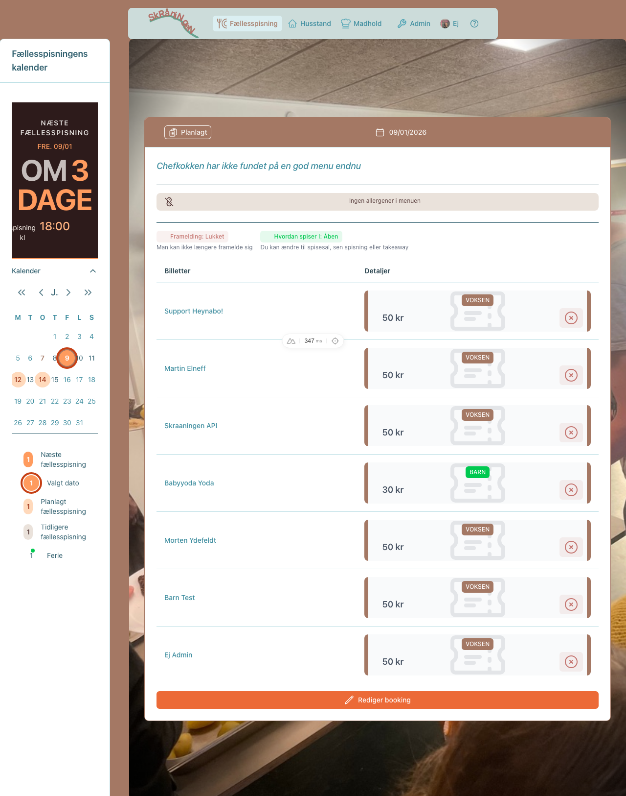
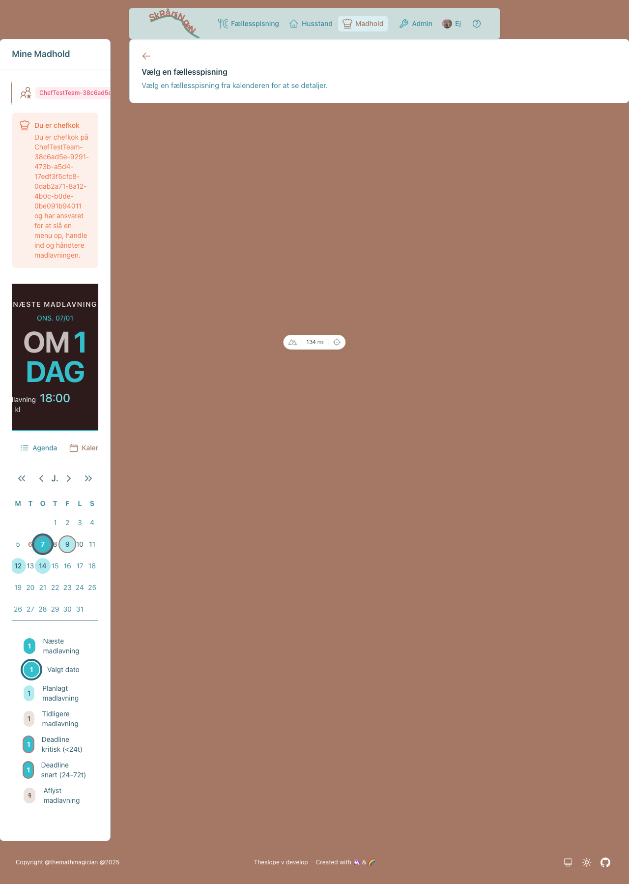
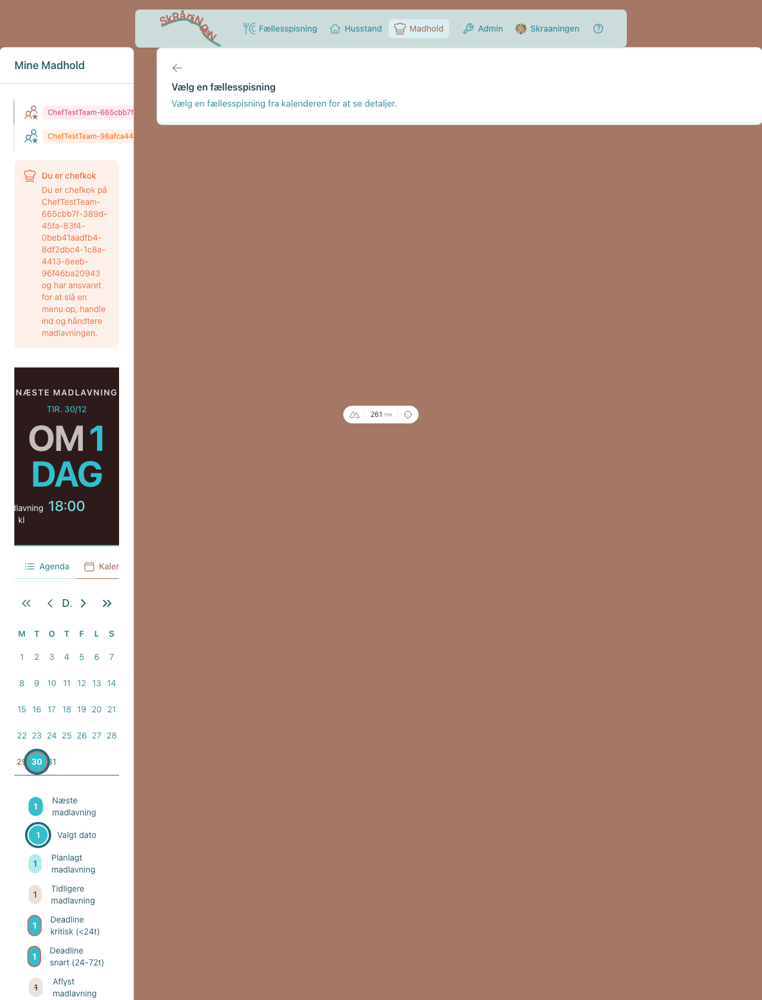
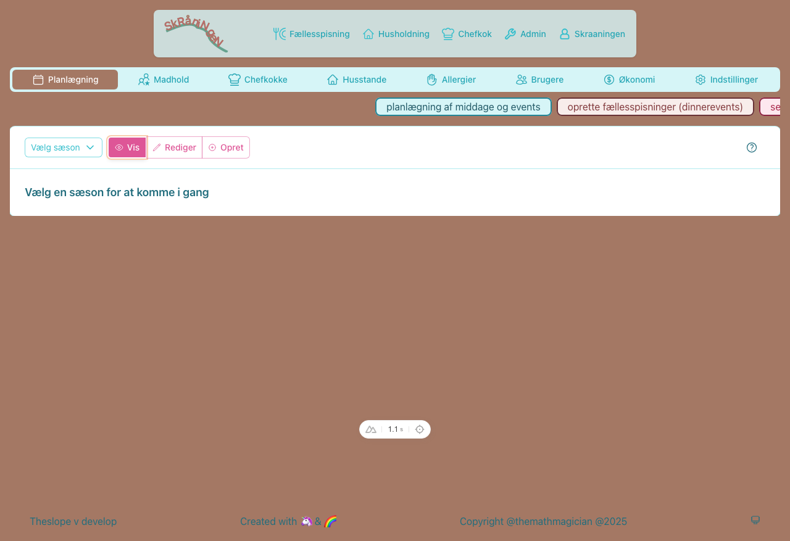
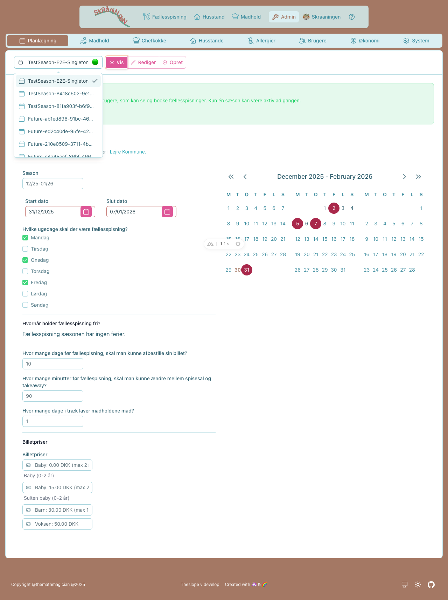
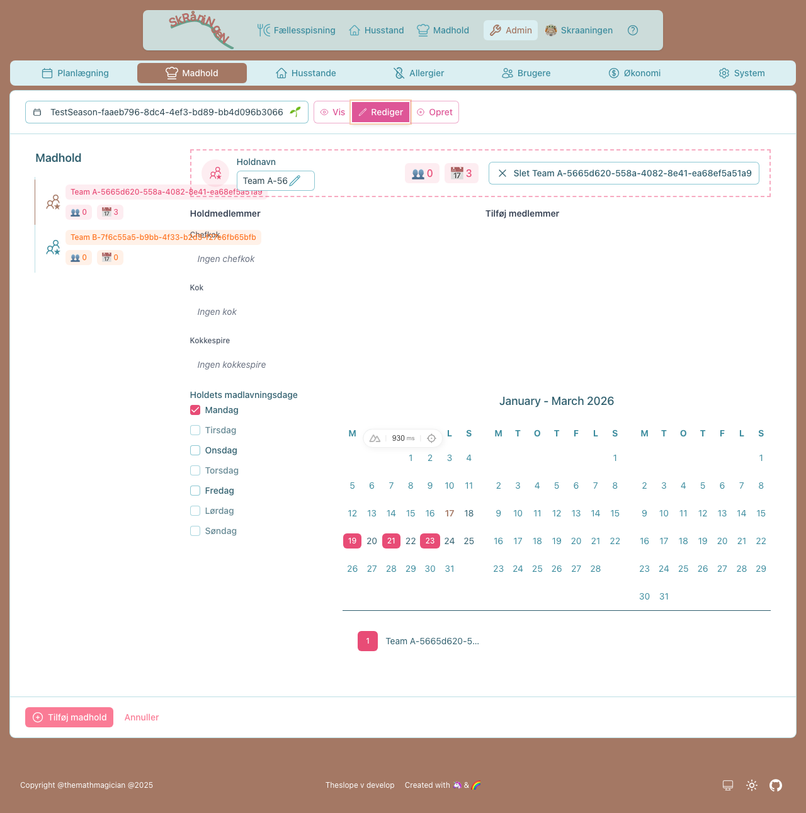
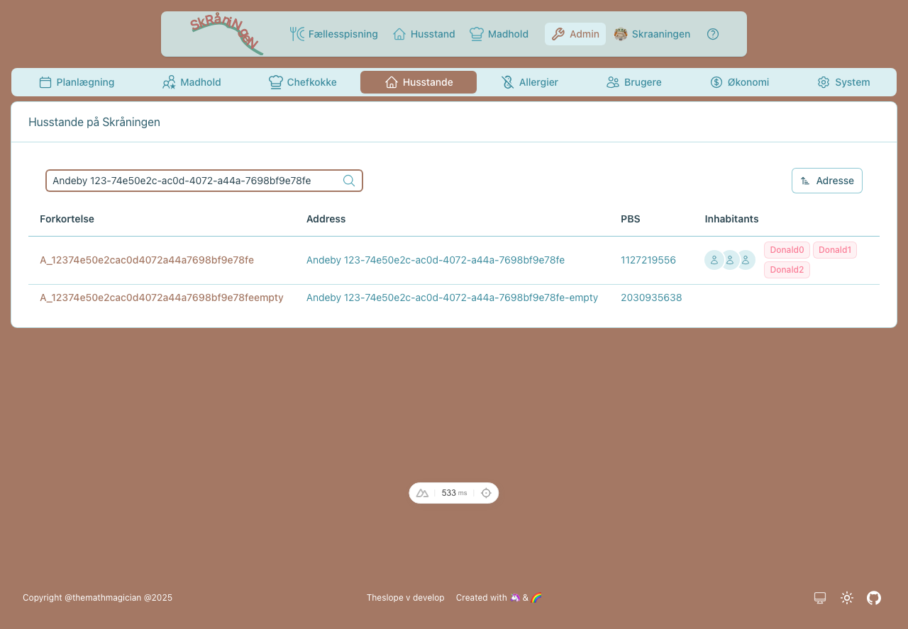

# TheSlope System Overview

TheSlope is a community dining management platform for Skråningen co-housing. It handles meal booking, cooking team coordination, billing, and integration with external systems (Heynabo, PBS).

> **User Guides:** [User Guide](user-guide.md) | [Chef Guide](chef-guide.md) | [Admin Guide](admin-guide.md)

---

## User Roles

| Role | Description | Primary Actions |
|------|-------------|-----------------|
| 👩‍🍳 **Chef** | Cooking team leader | Plan menus, announce dinners, manage team |
| 🤖 **Admin** | System administrator | Create seasons, manage households, handle billing |
| 😋 **Skråner** | Community member | Book meals, set preferences, manage allergies |

---

## Core Entities

```
Season (Sæson)
├── CookingTeam[] (Madhold)
│   └── CookingTeamAssignment[] (Chef, Cook, JuniorHelper)
├── DinnerEvent[] (Fællesspisning)
│   ├── Order[] (Billetter)
│   └── DinnerEventAllergen[] (Allergener)
└── TicketPrice[] (Billetpriser: Adult, Child, Baby)

Household (Husstand)
├── Inhabitant[] (Beboere)
│   ├── Allergy[] (Allergier)
│   ├── dinnerPreferences (Ugentlige præferencer)
│   └── Order[] (Bestillinger)
└── Invoice[] (Fakturaer)

User (Bruger)
├── Inhabitant? (Linked beboer)
└── systemRoles[] (ADMIN, ALLERGYMANAGER)
```

---

## Feature Matrix

### Implemented Features

| Feature | Description | Guide |
|---------|-------------|-------|
| **Season Management** | Create seasons, set cooking days, holidays, ticket prices | [Admin Guide](admin-guide.md#season-management) |
| **Season Activation** | Activate seasons, auto-scaffold pre-bookings | [Admin Guide](admin-guide.md#activate-a-season) |
| **Cooking Teams** | Create teams, assign members, set affinities | [Admin Guide](admin-guide.md#cooking-teams) |
| **Weekly Preferences** | Set DINEIN/TAKEAWAY/NONE per weekday per person | [User Guide](user-guide.md#sådan-sætter-du-ugentlige-præferencer) |
| **Preference Auto-Scaffolding** | Bookings auto-update when preferences change (ADR-015) | [User Guide](user-guide.md#sådan-sætter-du-ugentlige-præferencer) |
| **Meal Booking** | Book/cancel dinners, view calendar | [User Guide](user-guide.md#sådan-tilmelder-du-dig-fællesspisning) |
| **Allergy Management** | Track allergies per inhabitant | [User Guide](user-guide.md#sådan-tilføjer-du-allergier) |
| **Chef Dashboard** | View team, menu planning, allergen tracking | [Chef Guide](chef-guide.md) |
| **Heynabo Event Sync** | Announce menus to Heynabo calendar | [Chef Guide](chef-guide.md#annoncér-menu) |
| **Household Management** | View/edit households and inhabitants | [Admin Guide](admin-guide.md#household-management) |
| **Season Import** | Import calendar and teams from CSV | [Admin Guide](admin-guide.md#data-importexport) |
| **Billing Import** | Import orders from legacy CSV format | [Admin Guide](admin-guide.md#billing--economy) |
| **Daily Maintenance** | Auto-consume dinners, close orders, create transactions | [Admin Guide](admin-guide.md#system-maintenance) |
| **Monthly Billing** | Generate invoices, magic link sharing, CSV export | [Admin Guide](admin-guide.md#økonomi) |
| **Job History Panel** | View/trigger system jobs, track run history | [Admin Guide](admin-guide.md#systemvedligeholdelse) |
| **Authorization** | Role-based access control (Admin, AllergyManager) | — |

### Partially Implemented

| Feature | Remaining Work |
|---------|----------------|
| **Chef Components** | Missing component tests for DinnerStatusStepper, TeamRoleStatus, DinnerDetailPanel, ChefCalendarDisplay, AllergenMultiSelector |

### Planned

| Feature | Description |
|---------|-------------|
| **Ticket Swap** | Sell unused tickets to other households |
| **Guest Tickets** | Buy extra tickets for guests |
| **PBS Export** | Direct PBS file generation |
| **Chef Budget View** | Calculate budget from ticket counts |

---

## Screenshots

### User Dashboard

*Dashboard shown after login with quick actions for Dinner, Household, and Cooking Team*

### Dinner Calendar

*Public dinner calendar showing upcoming events with booking status*

### Household Views

*Household booking view showing family members and their reservations*


*VIEW mode: Compact badges show preferences. Click ✏️ to edit individual, ⚡ for power mode*


*EDIT mode: Button groups for each day with immediate save*

### Chef Views

*Chef view showing upcoming cooking assignments*


*Menu card with team info and allergen tracking*

### Admin Views

*Season planning with cooking days and holiday configuration*


*Season selector with status indicators: 🟢 Active | 🌱 Future | ⚪ Past*


*Team management with master-detail interface*


*Household list with inhabitants and quick search*

---

## ASCII Mockups

### Season Selector
```
┌─────────────────────────────────┐
│ 📅 Forår 2025            🟢 ▼ │  ← Selected (active season)
│ ─────────────────────────────── │
│ 📅 Forår 2025            🟢    │  ← ACTIVE - visible to all
│ 📅 Efterår 2025          🌱    │  ← FUTURE - can activate
│ 📅 Vinter 2025           🟡    │  ← CURRENT - dates match now
│ 📦 Efterår 2024          ⚪    │  ← PAST - archived
└─────────────────────────────────┘

Legend: 🟢 Active | 🌱 Future | 🟡 Current | ⚪ Past
```

### Team Management Interface
```
┌─────────────────┬────────────────────────────────────────────────┐
│ TEAMS (Left)    │ EDIT TEAM (Right)                              │
│                 │                                                │
│ □ Hold 1 [8]    │ 🍳 [Hold 2___________] 👤👤👤 [6 medlemmer]  │
│ ■ Hold 2 [6]    │                                                │
│ □ Hold 3 [0]    │ ┌Madlavningsdage─┬─Holdkalender──────────────┐ │
│ □ Hold 4 [5]    │ │☑ Mon  ☐ Fri    │ Oct  Nov  Dec             │ │
│ ...             │ │☑ Wed  ☐ Sat    │ 🔵1 🔵8  🔵15 🔵5  🔵12   │ │
│                 │ │☐ Thu  ☐ Sun    │ 🔵3 🔵10 ...              │ │
│                 │ └────────────────┴───────────────────────────┘ │
│                 │                                                │
│                 │ Holdmedlemmer                                  │
│                 │ ┌Chefkok────┬Kok─────────┬Kokkespire─────────┐ │
│                 │ │👤 Anna    │👤 Bob      │👤 Diana          │ │
│                 │ └───────────┴────────────┴───────────────────┘ │
└─────────────────┴────────────────────────────────────────────────┘
```

### Weekly Preferences Interface
```
┌───────────────────────────────────────────────────────────────┐
│ UCARD: Husstandens ugentlige booking præferencer              │
├───────────────────────────────────────────────────────────────┤
│ [⚡] Alle medlemmer  👥👥👥   🍽️ 🍽️ 🍽️ 🍽️ 🛍️  ← Power mode │
├───────────────────────────────────────────────────────────────┤
│ [✏️] Voksen  👤 Anna           🍽️ 🍽️ 🍽️ 🍽️ 🛍️              │
│ [✏️] Voksen  👤 Bob            🍽️ 🍽️ ❌ 🍽️ 🛍️              │
│ [✏️] Barn    👤 Clara          🍽️ 🍽️ 🍽️ 🍽️ 🛍️              │
│ [✏️] Baby    👤 David          ❌ ❌ ❌ ❌ ❌               │
└───────────────────────────────────────────────────────────────┘

EXPANDED ROW (Edit mode):
┌───────────────────────────────────────────────────────────────┐
│ [▼] Voksen  👤 Anna                                          │
│ ──────────────────────────────────────────────────────────── │
│  Mon: [🍽️ Spis][🕐 Sen][🛍️ Take][❌ Ingen]                  │
│  Tue: [🍽️ Spis][🕐 Sen][🛍️ Take][❌ Ingen]                  │
│  Wed: [🍽️ Spis][🕐 Sen][🛍️ Take][❌ Ingen]                  │
│  Thu: [🍽️ Spis][🕐 Sen][🛍️ Take][❌ Ingen]                  │
└───────────────────────────────────────────────────────────────┘

Legend: ⚡ Power mode | ✏️ Edit | 🍽️ Dine in | 🕐 Late | 🛍️ Takeaway | ❌ None
```

---

## Technical Architecture

| Layer | Technology |
|-------|------------|
| **Frontend** | Nuxt 4, Vue 3, TypeScript, Pinia, Nuxt UI 3 |
| **Backend** | Nuxt Server Routes, Prisma ORM |
| **Database** | Cloudflare D1 (SQLite) |
| **Hosting** | Cloudflare Workers/Pages |
| **External** | Heynabo API, PBS (planned) |

### Key Patterns
- **ADR-007:** SSR-friendly stores with `useAsyncData`
- **ADR-010:** Domain-driven serialization (repository layer)
- **ADR-015:** Idempotent automated jobs with rolling window

> **For developers:** See [Architecture Decision Records](adr.md) for detailed patterns.

---

*Last Updated: December 2025*
