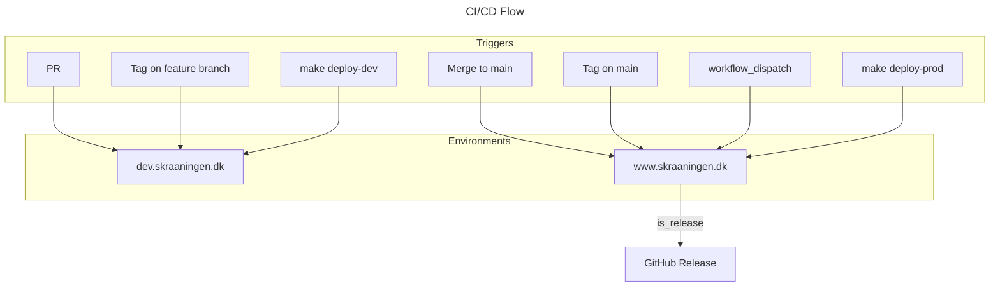

# Operations Runbook

Operational procedures for TheSlope infrastructure on Cloudflare.

## Cloudflare Configuration

### Zone: skraaningen.dk

| Subdomain | Environment | Worker |
|-----------|-------------|--------|
| `dev.skraaningen.dk` | Development | `theslope-dev` |
| `www.skraaningen.dk` | Production | `theslope-prod` |
| `skraaningen.dk` | Production | `theslope-prod` |
| — (no route, queue consumer) | Development | `theslope-sender-dev` |
| — (no route, queue consumer) | Production | `theslope-sender-prod` |

### Workers

| Worker | What | Config | Deploy |
|--------|------|--------|--------|
| `theslope-{env}` | The Nuxt app (HTTP + cron tasks). Bindings: `DB` (D1), `SENDER` (queue producer), `ARCHIVE` (R2) | `wrangler.toml` (root) | `make deploy-theslope-{env}` |
| `theslope-sender-{env}` | E-mail delivery: consumes the `theslope-sender-{env}` queue, sends via Cloudflare Email Service. Nitro app, no Vue. Health: `<host>/sender/health` (route `<host>/sender/*`) | `workers/sender/wrangler.toml` | `make deploy-sender-{env}` |

`make deploy-dev` / `make deploy-prod` (what CI runs) deploy **all** workers — the sender first, the app last. See [Sender](#sender-e-mail-delivery-worker).

---

## Sender (e-mail delivery worker)

Design: `docs/features/feature-proposal-notifications.md`. The app puts a complete message (`to`, `from`, `replyTo`, subject, body, attachments) on a Cloudflare Queue; `theslope-sender` consumes the queue and delivers through the `send_email` binding. Retries 3× (30/60/120 s); the last attempt logs an error and acknowledges the message.

### Resources per environment

| Environment | Worker | Queue | `send_email` binding |
|-------------|--------|-------|------------------------|
| local (miniflare) | `theslope-sender-local` | `theslope-sender-dev` (simulated) | sender `no-reply.dev@skraaningen.dk` |
| dev | `theslope-sender-dev` | `theslope-sender-dev` | sender `no-reply.dev@skraaningen.dk`; destinations limited to the dev test mailbox (dev shares the local D1 data) |
| prod | `theslope-sender-prod` | `theslope-sender-prod` | sender `no-reply@skraaningen.dk` |

Cloudflare enforces the limits on the binding (`allowed_sender_addresses` / `allowed_destination_addresses` in `workers/sender/wrangler.toml`). A message outside them fails with an `E_*` error, is logged with a masked recipient and acknowledged.

### One-time setup (admin)

Requires Workers Paid and the zone on Cloudflare DNS. Wrangler ≥ 4.83.

```bash
# 1. Email Service for the zone — once per account. DNS (SPF/DKIM/DMARC/cf-bounce) is auto-provisioned.
npx wrangler email sending enable skraaningen.dk
npx wrangler email sending dns get skraaningen.dk        # records it created
npx wrangler email sending settings skraaningen.dk       # expect: enabled / verified

# 2. Put the dev test mailbox on Cloudflare's list of confirmed destination addresses — once.
#    The dev sender binding may only deliver to mailboxes on that list (allowed_destination_addresses).
#    Cloudflare e-mails the address a confirmation link; click it.
npx wrangler email routing addresses create <dev test mailbox>
npx wrangler email routing addresses list                 # expect: verified

# 3. Prove the service
npx wrangler email sending send --from no-reply.dev@skraaningen.dk --to <dev test mailbox> \
    --subject "Skråningen: Email Service test" --text "Afsendt direkte via wrangler."

# 4. Queue — once per environment (dev shown; prod: same with -prod). Do this before the first deploy.
npx wrangler queues create theslope-sender-dev
npx wrangler queues info theslope-sender-dev              # expect: Queue ID + 0 consumers until the first deploy
```

### Local operator file `.env.dev` / `.env.prod` (gitignored — read by `make` via `with_env`)

| Key | Value |
|-----|-------|
| `BASE_URL` | the app's URL the targets call: `https://dev.skraaningen.dk` / `https://www.skraaningen.dk` (`.env`: the local dev server). The Makefile defines no URLs; CI sets `BASE_URL` from the deployed URL |
| `HEY_NABO_USERNAME` / `HEY_NABO_PASSWORD` | the admin login `theslope_call` uses (already present for the other `theslope-*` targets) |

### App config `.env` (local `nuxt dev`)

`runtimeConfig.notifications` holds the mailboxes, read from `NUXT_NOTIFICATIONS_*`: `.env` locally, worker secrets deployed. An unset mailbox makes the mail that needs it report `degraded` and log the variable name. Environment and site derive from `DEPLOY_URL` (`wrangler.toml` `[env.*.vars]`), locally from the request (`localhost:<port>` → `local`); sender address and display name derive from the environment.

| Key | Local value |
|-----|-------------|
| `NUXT_NOTIFICATIONS_ACCOUNTANT_EMAIL` | any address — the local queue is a miniflare sink |
| `NUXT_NOTIFICATIONS_ADMIN_EMAIL` | any address |

The CI e2e job sets placeholder addresses the same way (`cicd.yml`).

### Addresses

| Address | Value | Where it lives |
|---------|-------|----------------|
| `from` | dev: `Skråningen dev <no-reply.dev@skraaningen.dk>` · prod: `Skråningen prod <no-reply@skraaningen.dk>` — the sender line tells you which environment sent the mail. Bounces go to Cloudflare on `cf-bounce.skraaningen.dk` | derived from the environment in `app/config/notificationTemplates.ts` — `senderAddress` (`no-reply@` on prod, `no-reply.<environment>@` elsewhere) and `senderDisplayName` (`Skråningen <environment>`); the sender binding's `allowed_sender_addresses` (`workers/sender/wrangler.toml`) pins the same addresses |
| `replyTo` | the admin mailbox — receives replies when a resident answers a mail. A mail header only | `NUXT_NOTIFICATIONS_ADMIN_EMAIL` (worker secret per environment), set on every composed mail |
| `site` + environment | the host in signatures and links (`dev.skraaningen.dk` / `www.skraaningen.dk`); the environment (`local` / `dev` / `prod`) in `meta.environment`, the subject of the test mail and the display name | derived from `DEPLOY_URL` (root `wrangler.toml` `[env.*.vars]`), locally from the request origin (`deploymentFromUrl`) |

### Templates

One e-mail template per notification kind in `app/config/notificationTemplates.ts` (spread into `app.config.ts` `theslope.notifications`): `subject` and `text` with `{{placeholders}}`, filled by the event that raises the notification; `{{site}}`, `{{environment}}` and `{{dedupeKey}}` are filled for every kind and the signature `— Skråningen · {{site}}` is appended. A placeholder without a value, or a value without a placeholder, throws — the unit tests catch a template edit that breaks an event.

| Kind | Event | Recipient |
|------|-------|-----------|
| `TEST` | `make theslope-sender-event-test-<env>` | `NUXT_NOTIFICATIONS_ADMIN_EMAIL` |
| `BILLING_PERIOD_CLOSED` | monthly billing (cron / `POST /api/admin/maintenance/monthly`) closes a period (v1); re-send `make theslope-sender-event-monthly-billing-<env> bpid=<billingPeriodSummaryId>` | `NUXT_NOTIFICATIONS_ACCOUNTANT_EMAIL`, cc `NUXT_NOTIFICATIONS_ADMIN_EMAIL`; the period CSV attached (`…-v1.csv`) |
| `BILLING_PERIOD_UPDATED` | a later version of a period (catch-up billing changed it) — subject `opdatering v<n>`, replaces the earlier mail | same, CSV `…-v<n>.csv` |

### Secrets (admin, wrangler)

`wrangler secret put` prompts for the value on stdin. Secrets survive deploys. On the app worker (`theslope-dev` / `theslope-prod`):

| Secret | dev value | prod value | Used for |
|--------|-----------|------------|----------|
| `NUXT_NOTIFICATIONS_ACCOUNTANT_EMAIL` | the dev test mailbox | the accountant's mailbox | recipient of the monthly billing CSV |
| `NUXT_NOTIFICATIONS_ADMIN_EMAIL` | the dev test mailbox | the admin mailbox | reply-to on every mail, recipient of the test mail, cc on the monthly billing mail |

dev values are the test mailbox because the dev sender delivers to that mailbox only (destination limit above).

```bash
npx wrangler secret put NUXT_NOTIFICATIONS_ACCOUNTANT_EMAIL --env dev
npx wrangler secret put NUXT_NOTIFICATIONS_ADMIN_EMAIL --env dev
npx wrangler secret list --env dev                                  # names only; prod: the same two with --env prod
```

The app's other runtime secrets (`NUXT_SESSION_PASSWORD`, `HEY_NABO_USERNAME`, `HEY_NABO_PASSWORD`) are set the same way: `npx wrangler secret put <NAME> --env <env>`.

### Billing archive (R2)

The monthly billing job stores the period CSV in R2 under `billing/YYYY-MM/pbs-opgoerelse-YYYY-MM-v<version>.csv` (month of the cutoff date; metadata `billingPeriod`, `version`, `filename`, `jobRunId`) and mails it to the accountant. A period's `version` starts at 1 and is bumped when catch-up billing changes its content; every version is its own object, so the bucket listing is the audit trail of what the accountant received. Every delivery is a row in `Delivery` (`subjectType BILLING_PERIOD`, `subjectId`, `version`, `kind ARCHIVE | EMAIL | SMS`, `reference` = R2 key or mail dedupeKey, `jobRunId`, `deliveredAt`). Every run walks every closed period and redoes the kind whose highest delivered version is behind the period's version (mail: v1 = `BILLING_PERIOD_CLOSED`, later = `BILLING_PERIOD_UPDATED`, subject `opdatering v<n>`). The response lists `periods[]` with `version`, `csvUploaded` and `emailSent` (ADR-015). Migration `0015` inserts an `EMAIL` v1 delivery for the periods that predate the mail, so the first run after it archives their CSVs; mail starts with the next closed period. Locally the bucket is miniflare. Buckets, once per account:

```bash
npx wrangler r2 bucket create theslope-archive-dev     # local + dev (binding ARCHIVE)
npx wrangler r2 bucket create theslope-archive-prod    # prod
npx wrangler r2 bucket list
npx wrangler r2 object get theslope-archive-prod/billing/2026-08/pbs-opgoerelse-2026-08-v1.csv --file test-results/pbs-2026-08-v1.csv   # fetch an archived period version
```

### Deploy and verify

```bash
make deploy-dev                 # both workers: sender first, then the app (the CI target)
make theslope-sender-event-test-dev      # admin login on dev.skraaningen.dk → POST /api/admin/sender/event/test
                                # → prints {queued, dedupeKey}; the mail arrives in the admin mailbox (NUXT_NOTIFICATIONS_ADMIN_EMAIL) with that id in its text
make theslope-sender-event-monthly-billing-dev bpid=<id>   # re-send the accountant mail for a billing period (GET /api/admin/billing/periods lists ids)
make logs-sender-dev            # tail the sender: 📮 > SENDER > [EMAIL] delivered {dedupeKey, …}
make queues-info-dev            # backlog of the queue
make run-sender-local           # run the sender on this machine (miniflare, port 3100) → http://localhost:3100/sender/health
```

Sender events are the HTTP twins of notification triggers, one function each under `server/utils/sender/events/` used by the cron path and by `POST /api/admin/sender/event/<event>`; `make theslope-sender-event-<event>-<env>` calls them. On `local` the queue is a miniflare sink.

Same for prod with `-prod`. A mail from dev is recognisable twice over: sender `Skråningen dev <no-reply.dev@skraaningen.dk>` and the signature `— Skråningen · dev.skraaningen.dk`; prod sends as `Skråningen <no-reply@skraaningen.dk>` and signs `www.skraaningen.dk`.

### Failures

A retryable failure (`E_RATE_LIMIT_EXCEEDED`, `E_DAILY_LIMIT_EXCEEDED`, `E_INTERNAL_SERVER_ERROR`, network) is retried 3× at 30/60/120 s; the last attempt logs `[EMAIL] failed after 4 attempts` with the masked recipient and acknowledges the message. Every other failure is logged and acknowledged on the first attempt. `make logs-sender-<env>` shows them. The log line carries the message's `dedupeKey` (`<kind>:<channel>:<masked recipient>:<message id>`), which connects the app's producer log and the sender's log.

---

## Bot Protection

### Bot Fight Mode: DISABLED

Bot Fight Mode is **globally disabled** for the zone. This is required because:

1. Bot Fight Mode runs BEFORE WAF custom rules - cannot be bypassed per-request
2. GitHub Actions IPs (Microsoft/Azure datacenter) are flagged as suspicious by Bot Fight Mode
3. Cloudflare free plan doesn't allow Configuration Rules to disable Bot Fight Mode per-request

**Alternative protections in place:**
- Login rate limiting (see below)
- WAF bypass rule for CI/CD (defense in depth)

**Location:** Security → Bots → Bot Fight Mode = Off

---

## WAF Rules

### 1. CI/CD Smoke Test Bypass

Allows automated Playwright smoke tests to bypass remaining security features.

| Field | Value |
|-------|-------|
| **Rule name** | `CI/CD Smoke Test Bypass` |
| **Expression** | `(any(http.request.headers["x-bypass-token"][*] eq "TOKEN"))` |
| **Action** | Skip |
| **Priority** | First |

**Components to skip:**
- All Super Bot Fight Mode Rules
- Browser Integrity Check
- Security Level
- All rate limiting rules

**Token management:**
- Generate: `make generate-session-secret`
- Stored in: GitHub Secrets → `CLOUDFLARE_BYPASS_TOKEN` (both `dev` and `prod` environments)
- Used by: `.github/workflows/cicd.yml` → smoke-tests job
- Sent as: `x-bypass-token` HTTP header (configured in `playwright.config.ts`)

---

### 2. Login Brute Force Protection

Rate limits login attempts to prevent credential stuffing attacks.

| Field | Value |
|-------|-------|
| **Rule name** | `Login brute force protection` |
| **Expression** | `(http.request.uri.path eq "/api/auth/login")` |
| **Characteristics** | IP |
| **Rate** | 3 requests per 10 seconds |
| **Action** | Block |
| **Duration** | 10 seconds |

**Note:** Free plan limitation - minimum intervals are 10 seconds.

---

## GitHub Secrets & Variables

### Repository Secrets (CLOUDFLARE_THESLOPE environment)

| Secret | Purpose |
|--------|---------|
| `CLOUDFLARE_API_TOKEN` | Wrangler deployments |
| `NUXT_SESSION_PASSWORD` | Session encryption |
| `HEY_NABO_USERNAME` | Admin auth for tests |
| `HEY_NABO_PASSWORD` | Admin auth for tests |
| `HEY_NABO_EJ_ADMIN_USERNAME` | Member auth for tests |

### Environment-Specific Secrets (dev / prod)

| Secret | Purpose |
|--------|---------|
| `CLOUDFLARE_BYPASS_TOKEN` | WAF bypass for smoke tests |
| `HEY_NABO_USERNAME` | Environment-specific admin |
| `HEY_NABO_PASSWORD` | Environment-specific password |
| `HEY_NABO_EJ_ADMIN_USERNAME` | Environment-specific member |

### Repository Variables

| Variable | dev | prod |
|----------|-----|------|
| `NUXT_PUBLIC_HEY_NABO_API` | `https://demo.spaces.heynabo.com/api` | `https://skraaningeni.spaces.heynabo.com/api` |

---

## Release & Deployment

### Version Formats

TheSlope uses semantic versioning with build metadata:

| Type | Format | Example | When |
|------|--------|---------|------|
| **Release Candidate** | `{version}-rc.{commits}+{sha}` | `0.1.5-rc.3+a1b2c3d` | Automated dev deployments |
| **Production Release** | `{version}+{sha}` | `0.1.5+a1b2c3d` | Tagged releases to prod |

**Components:**
- `{version}`: Next patch version (auto-calculated from last git tag)
- `{commits}`: Commits since last tag (RC only)
- `{sha}`: Short commit SHA (7 chars)

### Version Display Locations

Users can verify the deployed version:

1. **PageFooter** - Visible on all pages
   - RC: `Theslope v0.1.5-rc.3+a1b2c3d · 2026-01-17`
   - Release: `Theslope v0.1.5+a1b2c3d · 2026-01-17`

2. **Health Endpoint** - Machine-readable (`/api/public/health`)
   ```json
   {
     "status": "ok",
     "timestamp": "2026-01-17T12:00:00.000Z",
     "version": "0.1.5+a1b2c3d",
     "releaseDate": "2026-01-17",
     "sha": "a1b2c3d1234567890abcdef",
     "isRelease": true
   }
   ```

### Deployment Routing Table

All deployments bake version info into the health endpoint (`/api/public/health`).

Only code from the `main` branch should reach production.



| Trigger | Condition | Target | Version | When to Use |
|---------|-----------|--------|---------|-------------|
| PR | branch ≠ main | dev | Auto RC | Feature development, testing |
| Push to main | branch = main | prod | Auto RC | Normal release flow |
| Tag push | commit on main | prod | From tag | Mark version milestone (GitOps) |
| Tag push | commit NOT on main | dev | From tag | Testing tag flow |
| workflow_dispatch + version | runs on main | prod | From input | Mark version milestone (UI) |
| workflow_dispatch (empty) | runs on main | prod | Auto RC | Force redeploy to prod |
| `make deploy-dev` | local | dev | Auto RC | Local testing on dev |
| `RELEASE_VERSION=x.y.z make deploy-dev` | local | dev | From input | Test release version on dev |
| `make deploy-prod` | local | prod | Auto RC | Emergency deploy |
| `RELEASE_VERSION=x.y.z make deploy-prod` | local | prod | From input | Emergency release |

### Deploy vs Release

| Action | What It Does | When to Use | Creates GitHub Release? |
|--------|--------------|-------------|-------------------------|
| **Deploy** | Ships code to environment | Every PR merge (automatic) | No |
| **Release** | Marks a version milestone | Business decision (manual) | Yes |

**Idempotent releases:** Re-running a release with the same version is safe. The CI/CD pipeline checks if the tag and GitHub release already exist and skips creation if so.

### Triggering Releases

**GitOps (recommended):**
```bash
git tag v0.9.0
git push origin v0.9.0
```

**GitHub CLI:**
```bash
gh workflow run cicd.yml -f release_version=0.9.0
gh run watch
```

**GitHub UI:**
1. Actions → CI/CD Pipeline → Run workflow
2. Enter version (e.g., `0.9.0`) in `release_version` field
3. Click "Run workflow"

**Local (emergency only, requires Wrangler auth):**
```bash
RELEASE_VERSION=0.9.0 make deploy-prod
```

### Makefile Targets

```bash
make deploy-dev              # Deploy ALL workers to dev (sender first, then the app)   ← CI
make deploy-prod             # Deploy ALL workers to prod                              ← CI
make deploy-theslope-dev     # The app alone (dev / prod)
make deploy-sender-dev       # The sender alone (dev / prod)
make logs-dev                # Tail the app (dev / prod)
make logs-sender-dev         # Tail the sender (dev / prod)
make theslope-sender-event-test-dev   # Test event: one real mail through the deployed pipe (local / dev / prod)
make theslope-sender-event-monthly-billing-dev bpid=<id>   # Re-send the accountant mail for a billing period (local / dev / prod)
make run-sender-local        # Run the sender locally (miniflare, port 3100)
make queues-info-dev         # Sender queue backlog (dev / prod)
make typegen                 # Regenerate wrangler binding typings for every worker
make version                 # Output current version
make version-info            # Output all version env vars
```

### Verify Deployment

```bash
curl -s https://www.skraaningen.dk/api/public/health | jq '.version'   # the app
curl -s https://www.skraaningen.dk/sender/health | jq '.version'       # the sender — same report, same version
```

The smoke job (`npm run test:e2e:smoke`, CI after every deploy) checks both against `EXPECTED_VERSION`.

### Rollback Process

**Via GitHub CLI:**
```bash
gh workflow run cicd.yml -f rollback_to=abc1234
gh run watch
```

**Via GitHub UI:**
1. Actions → CI/CD Pipeline → Run workflow
2. Enter commit SHA in `rollback_to` field
3. Workflow deploys that commit to prod

**Via Git CLI (local, requires Wrangler auth):**
```bash
git checkout v0.1.4
make deploy-prod
```

**Verification:**
```bash
curl https://www.skraaningen.dk/api/public/health | jq '.version'
# Should return: "0.1.4+oldsha"
```

---

## Schema Changes (Prisma → D1)

The schema is `prisma/schema.prisma`; D1 applies the SQL files in `migrations/` once each (tracked in the database's `d1_migrations` table). Every file in `migrations/` comes from the Make targets.

```bash
# 1. Edit prisma/schema.prisma (the model is signed off in the feature document first)
make d1-create-migration name=<change>   # prisma/migrations/<stamp>_<change>/migration.sql + migrations/NNNN_<change>.sql
make d1-prisma                               # format, validate, Prisma client + prisma/generated/zod (committed)
make d1-migrate-local                        # apply + seed the local D1 (miniflare), then nuxt dev + e2e
make d1-migrate-dev                          # before make deploy-dev
make d1-migrate-prod                         # before make deploy-prod
```

- The flattened file is named from the text after the last underscore of the migration directory: `name=delivery_and_versions` gives `0015_versions.sql`. A one-word name keeps both names equal.
- A data line (backfill) is written into the Prisma source file `prisma/migrations/<stamp>_<change>/migration.sql`, convergent (`WHERE NOT EXISTS …`, `max(…)`), and the flattened copy is regenerated: `rm migrations/NNNN_<change>.sql && make d1-flatten-migrations`.
- D1 stores `DateTime` as ISO-8601 text (`2026-06-16T22:00:00.000+00:00`); a date literal in SQL compares as text (`"cutoffDate" < '2026-09-17'`).
- Prisma rebuilds a SQLite table for a column change (`CREATE TABLE "new_…"`, copy, drop, rename, inside `PRAGMA defer_foreign_keys`); D1 runs this pattern (migrations `0002`–`0011`, `0015`).
- Reading a database for a check: `npx wrangler d1 execute theslope --local --command "SELECT …"` (`--remote --env dev|prod` for the deployed ones).

## Database Seeding

### Seed Structure

| Target | Files | In Git | When to Run |
|--------|-------|--------|-------------|
| `make d1-seed-prod` | `seed.sql` + `service-accounts.sql` | ✅ Yes | CI/CD, bootstrap |
| `make d1-seed-master-data-prod` | `prod-master-data-households.sql` | ❌ No (.theslope/) | Manual, after Heynabo import |

### Bootstrap New Environment

```bash
make d1-migrate-prod           # Migrations + seeds (seed.sql + service-accounts.sql)
make d1-seed-master-data-prod  # PBS ID mappings (confidential, manual)
```

Then the sender's queues + Email Service — see [Sender → One-time setup](#one-time-setup-admin).

### Re-run Seeds Only (no migrations)

```bash
make d1-seed-prod              # seed.sql + service-accounts.sql
make d1-seed-master-data-prod  # PBS ID mappings (confidential)
```

### Service Accounts

Service accounts (heynaboId 1, 212) have preferences set to NONE to prevent scaffolding.
File: `migrations/seed/service-accounts.sql`

---

## Routine Operations

### Rotate Cloudflare Bypass Token

1. Generate new token: `make generate-session-secret`
2. Update Cloudflare WAF rule expression with new token
3. Update GitHub Secrets: `CLOUDFLARE_BYPASS_TOKEN` in both `dev` and `prod` environments
4. Verify: Push a commit to trigger smoke tests

### Check Bot Fight Mode Status

1. Cloudflare Dashboard → skraaningen.dk → Security → Bots
2. Verify Bot Fight Mode is **disabled** (required for CI/CD)
3. Check WAF bypass rule is active

### View Rate Limiting Metrics

1. Cloudflare Dashboard → skraaningen.dk → Security → WAF → Rate limiting rules
2. Click rule to view metrics
3. Check for legitimate users being blocked (adjust rate if needed)

---

## Troubleshooting

### Smoke Tests Failing with 403

**Symptom:** `setup-ui` auth fails, page shows "Verifying you are human"

**Cause:** Cloudflare Bot Fight Mode blocking Playwright from GitHub Actions (datacenter IPs)

**Diagnosis:**
1. Check Security → Events for `source: botFight` entries
2. GitHub Actions IPs show as `MICROSOFT-CORP-MSN-AS-BLOCK` ASN

**Fix:**
1. Verify Bot Fight Mode is **disabled** (Security → Bots)
2. Verify `CLOUDFLARE_BYPASS_TOKEN` is set in GitHub environment secrets (dev AND prod)
3. Verify WAF bypass rule expression matches the token
4. Verify `playwright.config.ts` sends `x-bypass-token` header

**Key insight:** Bot Fight Mode runs BEFORE WAF custom rules, so it cannot be bypassed per-request on free plan. Must be disabled globally.

### Smoke Tests Failing with 429

**Symptom:** Rate limit exceeded

**Fix:**
1. Check WAF bypass rule skips "All rate limiting rules"
2. Or increase rate limit threshold in the rate limiting rule

### Smoke Tests Pass Locally But Fail in CI/CD

**Symptom:** Tests work from your machine but fail from GitHub Actions

**Cause:** Cloudflare treats datacenter IPs (GitHub Actions) differently from residential IPs

**Fix:** Ensure Bot Fight Mode is disabled - it specifically targets datacenter/cloud IPs.

---

*Last updated: January 2026*
