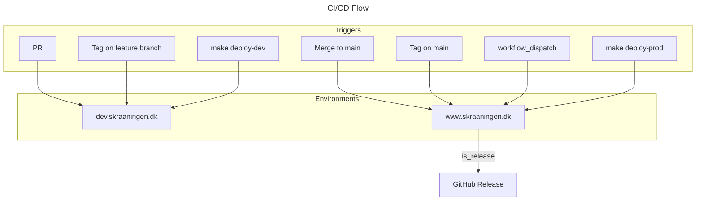

# Operations Runbook

Operational procedures for TheSlope infrastructure on Cloudflare.

## Cloudflare Configuration

### Zone: skraaningen.dk

| Subdomain | Environment | Worker |
|-----------|-------------|--------|
| `dev.skraaningen.dk` | Development | `theslope-dev` |
| `www.skraaningen.dk` | Production | `theslope-prod` |
| `skraaningen.dk` | Production | `theslope-prod` |
| — (no route, queue consumer) | Development | `theslope-sender-dev` |
| — (no route, queue consumer) | Production | `theslope-sender-prod` |

### Workers

| Worker | What | Config | Deploy |
|--------|------|--------|--------|
| `theslope-{env}` | The Nuxt app (HTTP + cron tasks) | `wrangler.toml` (root) | `make deploy-theslope-{env}` |
| `theslope-sender-{env}` | E-mail delivery: consumes the `theslope-sender-{env}` queue, sends via Cloudflare Email Service. Nitro app, no Vue. | `workers/sender/wrangler.toml` | `make deploy-sender-{env}` |

`make deploy-dev` / `make deploy-prod` (what CI runs) deploy **all** workers — the sender first, the app last. See [Sender](#sender-e-mail-delivery-worker).

---

## Sender (e-mail delivery worker)

Design: `docs/features/feature-proposal-notifications.md`. The app puts a complete message (`to`, `from`, `replyTo`, subject, body, attachments) on a Cloudflare Queue; `theslope-sender` consumes the queue and delivers through the `send_email` binding. Retries 3× (30/60/120 s), then the message lands in the dead-letter queue (kept 14 days).

### Resources per environment

| Environment | Worker | Queue | Dead-letter queue | `send_email` binding |
|-------------|--------|-------|-------------------|------------------------|
| local (miniflare) | `theslope-sender-local` | `theslope-sender-local` | `theslope-sender-dlq-local` | sender `no-reply.dev@skraaningen.dk` |
| dev | `theslope-sender-dev` | `theslope-sender-dev` | `theslope-sender-dlq-dev` | sender `no-reply.dev@skraaningen.dk`; destinations limited to the dev test mailbox (dev shares the local D1 data) |
| prod | `theslope-sender-prod` | `theslope-sender-prod` | `theslope-sender-dlq-prod` | sender `no-reply@skraaningen.dk` |

Cloudflare enforces the limits on the binding (`allowed_sender_addresses` / `allowed_destination_addresses` in `workers/sender/wrangler.toml`). A message outside them fails with an `E_*` error, is logged with a masked recipient and acknowledged.

### One-time setup (admin)

Requires Workers Paid and the zone on Cloudflare DNS. Wrangler ≥ 4.83.

```bash
# 1. Email Service for the zone — once per account. DNS (SPF/DKIM/DMARC/cf-bounce) is auto-provisioned.
npx wrangler email sending enable skraaningen.dk
npx wrangler email sending dns get skraaningen.dk        # records it created
npx wrangler email sending settings skraaningen.dk       # expect: enabled / verified

# 2. Put the dev test mailbox on Cloudflare's list of confirmed destination addresses — once.
#    The dev sender binding may only deliver to mailboxes on that list (allowed_destination_addresses).
#    Cloudflare e-mails the address a confirmation link; click it.
npx wrangler email routing addresses create <dev test mailbox>
npx wrangler email routing addresses list                 # expect: verified

# 3. Prove the service
npx wrangler email sending send --from no-reply.dev@skraaningen.dk --to <dev test mailbox> \
    --subject "Skråningen: Email Service test" --text "Afsendt direkte via wrangler."

# 4. Queue + dead-letter queue — once per environment (dev shown; prod: same with -prod). Do this before the first deploy.
npx wrangler queues create theslope-sender-dev
npx wrangler queues create theslope-sender-dlq-dev
npx wrangler queues update theslope-sender-dlq-dev --message-retention-period-secs 1209600   # 14 days
npx wrangler queues info theslope-sender-dev              # note the queue id (needed below)
```

### Local operator file `.env.dev` / `.env.prod` (gitignored — read by `make` via `with_env`)

| Key | Value |
|-----|-------|
| `CLOUDFLARE_ACCOUNT_ID` | account id — `npx wrangler whoami` |
| `CLOUDFLARE_API_TOKEN` | an operator token with **Account · Queues · Edit** (publishes the test message) |
| `QUEUE_ID_SENDER` | id from `wrangler queues info theslope-sender-<env>` |
| `SENDER_TEST_EMAIL` | where the test mail is delivered — the dev test mailbox (must be on the confirmed destination list, step 2 above) |
| `SENDER_REPLY_TO` | reply-to header of the test mail (optional) |

### Addresses

| Address | Value | Where it lives |
|---------|-------|----------------|
| `from` | dev: `no-reply.dev@skraaningen.dk` · prod: `no-reply@skraaningen.dk` — the address tells you which environment sent the mail. Bounces go to Cloudflare on `cf-bounce.skraaningen.dk` | pinned per environment by `allowed_sender_addresses` (`workers/sender/wrangler.toml`); the app reads `NUXT_NOTIFICATIONS_FROM` from the root `wrangler.toml` `[env.*.vars]`; `verify-email.sh` derives it from the env argument |
| `replyTo` | the mailbox that receives replies when a resident answers a mail — one per environment. A mail header only | Worker secret `NUXT_NOTIFICATIONS_REPLY_TO` on the app (`theslope-dev` / `theslope-prod`), read at runtime as `runtimeConfig.notifications.replyTo` (same mechanism as `NUXT_SESSION_PASSWORD`); the test mail takes it from `SENDER_REPLY_TO` in `.env.<env>` |

### Secrets (admin, wrangler)

`wrangler secret put` prompts for the value on stdin. Secrets survive deploys.

```bash
# reply-to used by every mail the app composes (producer task) — dev: the test mailbox, prod: the mailbox that answers residents
npx wrangler secret put NUXT_NOTIFICATIONS_REPLY_TO --env dev
npx wrangler secret put NUXT_NOTIFICATIONS_REPLY_TO --env prod
npx wrangler secret list --env dev                                  # names only
```

The app's other runtime secrets (`NUXT_SESSION_PASSWORD`, `HEY_NABO_USERNAME`, `HEY_NABO_PASSWORD`) are set the same way: `npx wrangler secret put <NAME> --env <env>`.

### Deploy and verify

```bash
make deploy-sender-dev          # nitro build + wrangler deploy (also part of make deploy-dev)
make sender-verify-email-dev    # publishes one TEST e-mail to the queue, waits for "[EMAIL] delivered <id>" in the
                                # sender's logs, checks backlog 0 — then look for the id in the test mailbox
make logs-sender-dev            # tail the sender
make queues-info-dev            # backlog of queue + dead-letter queue
```

Same for prod with `-prod`. A mail from dev is recognisable twice over: sender `no-reply.dev@skraaningen.dk` and the signature `— Skråningen · dev.skraaningen.dk`; prod sends from `no-reply@skraaningen.dk` and signs `www.skraaningen.dk`.

### Dead-letter queue triage

Messages reach `theslope-sender-dlq-<env>` after 3 retryable failures (provider throttling or outage — `E_RATE_LIMIT_EXCEEDED`, `E_DAILY_LIMIT_EXCEEDED`, `E_INTERNAL_SERVER_ERROR`, network). **The DLQ holds full message bodies (recipient addresses, text) for 14 days.**

```bash
npx wrangler queues info theslope-sender-dlq-<env>       # backlog
npx wrangler queues purge theslope-sender-dlq-<env>      # drop the messages once handled
```

Every log line carries the message's `dedupeKey` (`<kind>:<channel>:<recipient>:<subject>`), so one grep connects the app's producer log, the sender's log and the DLQ body.

---

## Bot Protection

### Bot Fight Mode: DISABLED

Bot Fight Mode is **globally disabled** for the zone. This is required because:

1. Bot Fight Mode runs BEFORE WAF custom rules - cannot be bypassed per-request
2. GitHub Actions IPs (Microsoft/Azure datacenter) are flagged as suspicious by Bot Fight Mode
3. Cloudflare free plan doesn't allow Configuration Rules to disable Bot Fight Mode per-request

**Alternative protections in place:**
- Login rate limiting (see below)
- WAF bypass rule for CI/CD (defense in depth)

**Location:** Security → Bots → Bot Fight Mode = Off

---

## WAF Rules

### 1. CI/CD Smoke Test Bypass

Allows automated Playwright smoke tests to bypass remaining security features.

| Field | Value |
|-------|-------|
| **Rule name** | `CI/CD Smoke Test Bypass` |
| **Expression** | `(any(http.request.headers["x-bypass-token"][*] eq "TOKEN"))` |
| **Action** | Skip |
| **Priority** | First |

**Components to skip:**
- All Super Bot Fight Mode Rules
- Browser Integrity Check
- Security Level
- All rate limiting rules

**Token management:**
- Generate: `make generate-session-secret`
- Stored in: GitHub Secrets → `CLOUDFLARE_BYPASS_TOKEN` (both `dev` and `prod` environments)
- Used by: `.github/workflows/cicd.yml` → smoke-tests job
- Sent as: `x-bypass-token` HTTP header (configured in `playwright.config.ts`)

---

### 2. Login Brute Force Protection

Rate limits login attempts to prevent credential stuffing attacks.

| Field | Value |
|-------|-------|
| **Rule name** | `Login brute force protection` |
| **Expression** | `(http.request.uri.path eq "/api/auth/login")` |
| **Characteristics** | IP |
| **Rate** | 3 requests per 10 seconds |
| **Action** | Block |
| **Duration** | 10 seconds |

**Note:** Free plan limitation - minimum intervals are 10 seconds.

---

## GitHub Secrets & Variables

### Repository Secrets (CLOUDFLARE_THESLOPE environment)

| Secret | Purpose |
|--------|---------|
| `CLOUDFLARE_API_TOKEN` | Wrangler deployments |
| `NUXT_SESSION_PASSWORD` | Session encryption |
| `DB_D1_ID` | Database identifier |
| `HEY_NABO_USERNAME` | Admin auth for tests |
| `HEY_NABO_PASSWORD` | Admin auth for tests |
| `HEY_NABO_EJ_ADMIN_USERNAME` | Member auth for tests |

### Environment-Specific Secrets (dev / prod)

| Secret | Purpose |
|--------|---------|
| `CLOUDFLARE_BYPASS_TOKEN` | WAF bypass for smoke tests |
| `HEY_NABO_USERNAME` | Environment-specific admin |
| `HEY_NABO_PASSWORD` | Environment-specific password |
| `HEY_NABO_EJ_ADMIN_USERNAME` | Environment-specific member |

### Repository Variables

| Variable | dev | prod |
|----------|-----|------|
| `BASE_URL` | `https://dev.skraaningen.dk` | `https://www.skraaningen.dk` |
| `NUXT_PUBLIC_HEY_NABO_API` | `https://demo.spaces.heynabo.com/api` | `https://skraaningeni.spaces.heynabo.com/api` |
| `DB_D1_NAME` | `theslope` | `theslope-prod` |

---

## Release & Deployment

### Version Formats

TheSlope uses semantic versioning with build metadata:

| Type | Format | Example | When |
|------|--------|---------|------|
| **Release Candidate** | `{version}-rc.{commits}+{sha}` | `0.1.5-rc.3+a1b2c3d` | Automated dev deployments |
| **Production Release** | `{version}+{sha}` | `0.1.5+a1b2c3d` | Tagged releases to prod |

**Components:**
- `{version}`: Next patch version (auto-calculated from last git tag)
- `{commits}`: Commits since last tag (RC only)
- `{sha}`: Short commit SHA (7 chars)

### Version Display Locations

Users can verify the deployed version:

1. **PageFooter** - Visible on all pages
   - RC: `Theslope v0.1.5-rc.3+a1b2c3d · 2026-01-17`
   - Release: `Theslope v0.1.5+a1b2c3d · 2026-01-17`

2. **Health Endpoint** - Machine-readable (`/api/public/health`)
   ```json
   {
     "status": "ok",
     "timestamp": "2026-01-17T12:00:00.000Z",
     "version": "0.1.5+a1b2c3d",
     "releaseDate": "2026-01-17",
     "sha": "a1b2c3d1234567890abcdef",
     "isRelease": true
   }
   ```

### Deployment Routing Table

All deployments bake version info into the health endpoint (`/api/public/health`).

Only code from the `main` branch should reach production.



| Trigger | Condition | Target | Version | When to Use |
|---------|-----------|--------|---------|-------------|
| PR | branch ≠ main | dev | Auto RC | Feature development, testing |
| Push to main | branch = main | prod | Auto RC | Normal release flow |
| Tag push | commit on main | prod | From tag | Mark version milestone (GitOps) |
| Tag push | commit NOT on main | dev | From tag | Testing tag flow |
| workflow_dispatch + version | runs on main | prod | From input | Mark version milestone (UI) |
| workflow_dispatch (empty) | runs on main | prod | Auto RC | Force redeploy to prod |
| `make deploy-dev` | local | dev | Auto RC | Local testing on dev |
| `RELEASE_VERSION=x.y.z make deploy-dev` | local | dev | From input | Test release version on dev |
| `make deploy-prod` | local | prod | Auto RC | Emergency deploy |
| `RELEASE_VERSION=x.y.z make deploy-prod` | local | prod | From input | Emergency release |

### Deploy vs Release

| Action | What It Does | When to Use | Creates GitHub Release? |
|--------|--------------|-------------|-------------------------|
| **Deploy** | Ships code to environment | Every PR merge (automatic) | No |
| **Release** | Marks a version milestone | Business decision (manual) | Yes |

**Idempotent releases:** Re-running a release with the same version is safe. The CI/CD pipeline checks if the tag and GitHub release already exist and skips creation if so.

### Triggering Releases

**GitOps (recommended):**
```bash
git tag v0.9.0
git push origin v0.9.0
```

**GitHub CLI:**
```bash
gh workflow run cicd.yml -f release_version=0.9.0
gh run watch
```

**GitHub UI:**
1. Actions → CI/CD Pipeline → Run workflow
2. Enter version (e.g., `0.9.0`) in `release_version` field
3. Click "Run workflow"

**Local (emergency only, requires Wrangler auth):**
```bash
RELEASE_VERSION=0.9.0 make deploy-prod
```

### Makefile Targets

```bash
make deploy-dev              # Deploy ALL workers to dev (sender first, then the app)   ← CI
make deploy-prod             # Deploy ALL workers to prod                              ← CI
make deploy-theslope-dev     # The app alone (dev / prod)
make deploy-sender-dev       # The sender alone (dev / prod)
make logs-dev                # Tail the app (dev / prod)
make logs-sender-dev         # Tail the sender (dev / prod)
make sender-verify-email-dev # Send + verify one test e-mail through the queue (dev / prod)
make queues-info-dev         # Sender queue + DLQ backlog (dev / prod)
make typegen                 # Regenerate wrangler binding typings for every worker
make version                 # Output current version
make version-info            # Output all version env vars
```

### Verify Deployment

```bash
curl -s https://www.skraaningen.dk/api/public/health | jq '.version'
```

### Rollback Process

**Via GitHub CLI:**
```bash
gh workflow run cicd.yml -f rollback_to=abc1234
gh run watch
```

**Via GitHub UI:**
1. Actions → CI/CD Pipeline → Run workflow
2. Enter commit SHA in `rollback_to` field
3. Workflow deploys that commit to prod

**Via Git CLI (local, requires Wrangler auth):**
```bash
git checkout v0.1.4
make deploy-prod
```

**Verification:**
```bash
curl https://www.skraaningen.dk/api/public/health | jq '.version'
# Should return: "0.1.4+oldsha"
```

---

## Database Seeding

### Seed Structure

| Target | Files | In Git | When to Run |
|--------|-------|--------|-------------|
| `make d1-seed-prod` | `seed.sql` + `service-accounts.sql` | ✅ Yes | CI/CD, bootstrap |
| `make d1-seed-master-data-prod` | `prod-master-data-households.sql` | ❌ No (.theslope/) | Manual, after Heynabo import |

### Bootstrap New Environment

```bash
make d1-migrate-prod           # Migrations + seeds (seed.sql + service-accounts.sql)
make d1-seed-master-data-prod  # PBS ID mappings (confidential, manual)
```

Then the sender's queues + Email Service — see [Sender → One-time setup](#one-time-setup-admin).

### Re-run Seeds Only (no migrations)

```bash
make d1-seed-prod              # seed.sql + service-accounts.sql
make d1-seed-master-data-prod  # PBS ID mappings (confidential)
```

### Service Accounts

Service accounts (heynaboId 1, 212) have preferences set to NONE to prevent scaffolding.
File: `migrations/seed/service-accounts.sql`

---

## Routine Operations

### Rotate Cloudflare Bypass Token

1. Generate new token: `make generate-session-secret`
2. Update Cloudflare WAF rule expression with new token
3. Update GitHub Secrets: `CLOUDFLARE_BYPASS_TOKEN` in both `dev` and `prod` environments
4. Verify: Push a commit to trigger smoke tests

### Check Bot Fight Mode Status

1. Cloudflare Dashboard → skraaningen.dk → Security → Bots
2. Verify Bot Fight Mode is **disabled** (required for CI/CD)
3. Check WAF bypass rule is active

### View Rate Limiting Metrics

1. Cloudflare Dashboard → skraaningen.dk → Security → WAF → Rate limiting rules
2. Click rule to view metrics
3. Check for legitimate users being blocked (adjust rate if needed)

---

## Troubleshooting

### Smoke Tests Failing with 403

**Symptom:** `setup-ui` auth fails, page shows "Verifying you are human"

**Cause:** Cloudflare Bot Fight Mode blocking Playwright from GitHub Actions (datacenter IPs)

**Diagnosis:**
1. Check Security → Events for `source: botFight` entries
2. GitHub Actions IPs show as `MICROSOFT-CORP-MSN-AS-BLOCK` ASN

**Fix:**
1. Verify Bot Fight Mode is **disabled** (Security → Bots)
2. Verify `CLOUDFLARE_BYPASS_TOKEN` is set in GitHub environment secrets (dev AND prod)
3. Verify WAF bypass rule expression matches the token
4. Verify `playwright.config.ts` sends `x-bypass-token` header

**Key insight:** Bot Fight Mode runs BEFORE WAF custom rules, so it cannot be bypassed per-request on free plan. Must be disabled globally.

### Smoke Tests Failing with 429

**Symptom:** Rate limit exceeded

**Fix:**
1. Check WAF bypass rule skips "All rate limiting rules"
2. Or increase rate limit threshold in the rate limiting rule

### Smoke Tests Pass Locally But Fail in CI/CD

**Symptom:** Tests work from your machine but fail from GitHub Actions

**Cause:** Cloudflare treats datacenter IPs (GitHub Actions) differently from residential IPs

**Fix:** Ensure Bot Fight Mode is disabled - it specifically targets datacenter/cloud IPs.

---

*Last updated: January 2026*
