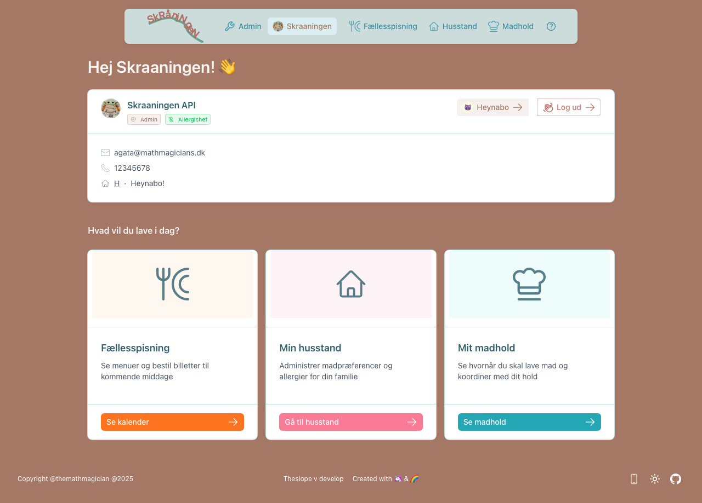
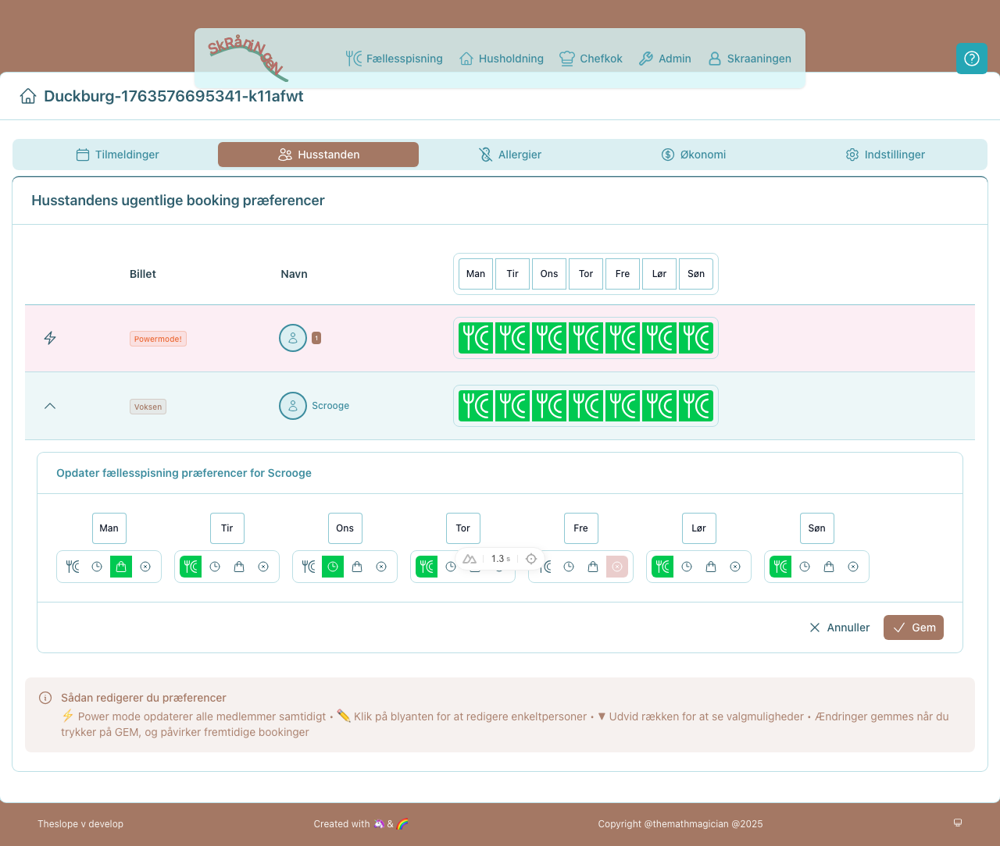
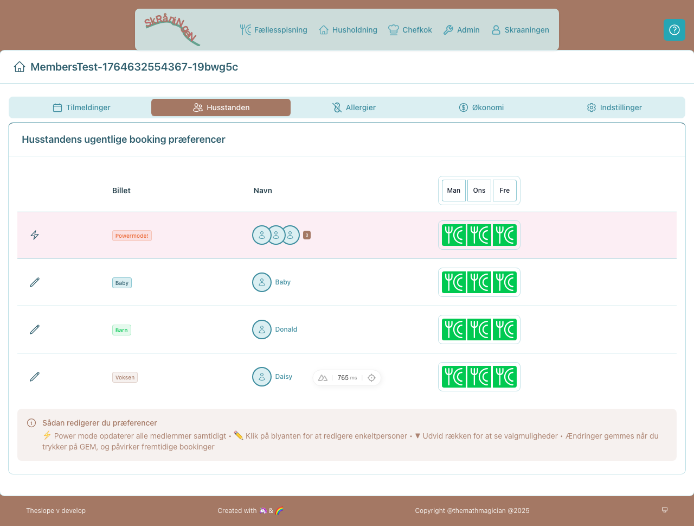
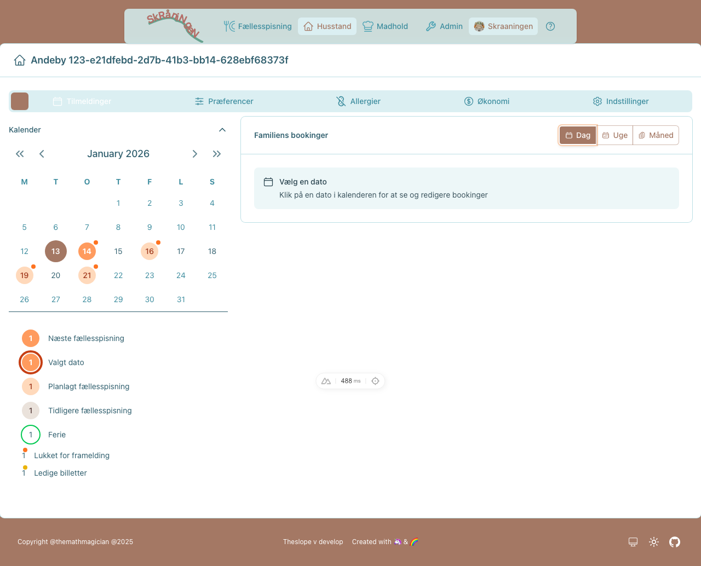
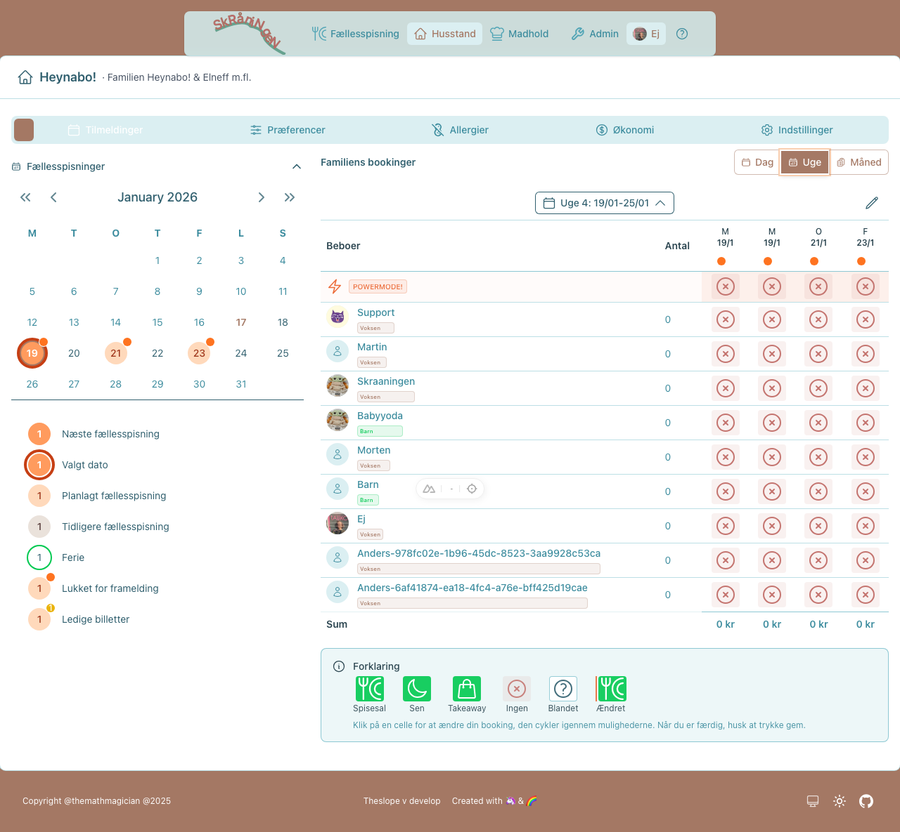
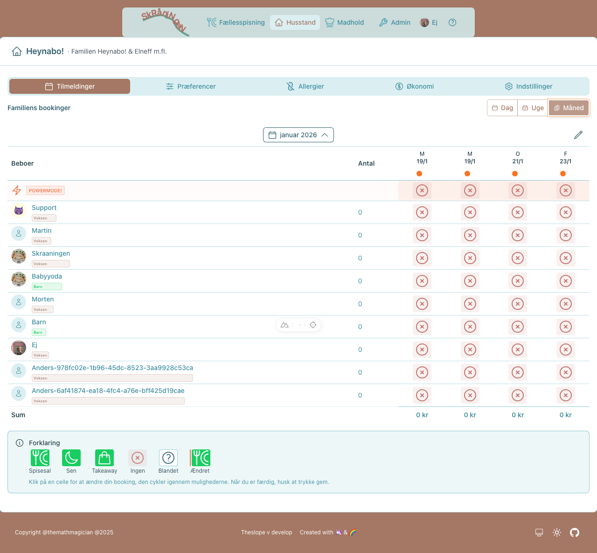
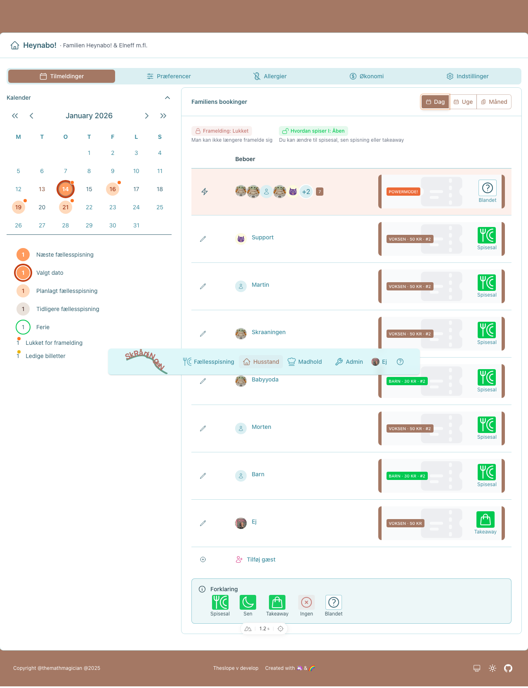
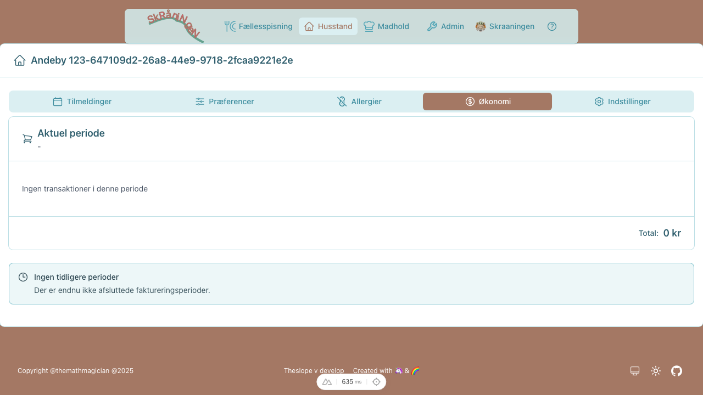
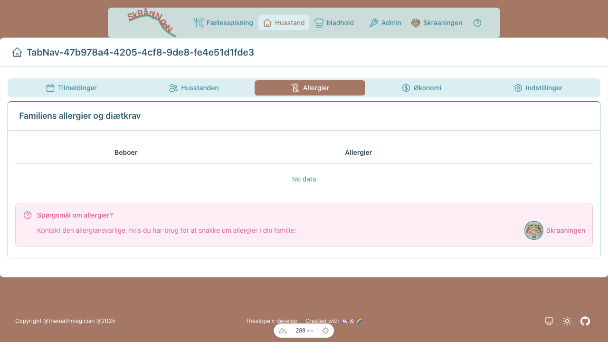

# Brugerguide til Skråningens Fællesspisning

Velkommen til TheSlope - Skråningens system til fællesspisning! Denne guide hjælper dig med de mest almindelige opgaver.

> **Se også:** [Chefkokguide](chef-guide.md) | [Administratorguide](admin-guide.md) | [Systemoversigt](features.md)

> **Tip:** Klik på hjælp-ikonet (?) i øverste højre hjørne for kontekstafhængig hjælp på hver side.

---

## For at bruge Skrånerappen...

Før du kan logge ind, skal du sikre dig følgende i **Heynabo**:

1. **Du har en Heynabo-konto** - Login bruger din Heynabo email og password
2. **Dine børn er tilføjet med fødselsdato** - Vigtigt! Billetprisen beregnes ud fra alder:
   - **Baby** (0-1 år) - idegratis
   - **Barn** (2-11 år) - reduceret pris
   - **Voksen** (12+ år) - fuld pris

> **Vigtigt for forældre:** Tjek at dine børn er registreret i Heynabo **med korrekt fødselsdato**. Uden fødselsdato betaler du voksenpris for alle børn! Tilføj eller ret børnenes fødselsdato i Heynabo - så synkroniseres det automatisk til Skrånerappen.

### Sådan tjekker du dine børns billettype

1. Log ind på [skraaningen.dk](https://www.skraaningen.dk)
2. Gå til [Husstanden](https://www.skraaningen.dk/household) (fanen med hus-ikon)
3. Se listen over husstandens medlemmer
4. Hver person vises med deres billettype: Baby, Barn eller Voksen

Står dit barn som **Voksen** selvom de er under 12 år? Så mangler fødselsdatoen i Heynabo. Ret det i Heynabo-appen, og det opdateres automatisk i Skrånerappen.

---

## Hurtige links

| Sektion | Link | Beskrivelse |
|---------|------|-------------|
| **Forside** | [skraaningen.dk](https://www.skraaningen.dk) | Log ind og se overblik |
| **Tilmeldinger** | [skraaningen.dk/household/[din-husstand]/bookings](https://www.skraaningen.dk/household) | Se og book middage |
| **Husstanden** | [skraaningen.dk/household/[din-husstand]](https://www.skraaningen.dk/household) | Se medlemmer og præferencer |
| **Middagskalender** | [skraaningen.dk/dinner](https://www.skraaningen.dk/dinner) | Se kommende middage |
| **Chef-side** | [skraaningen.dk/chef](https://www.skraaningen.dk/chef) | Administrer madlavningsdage |

---

## Symboler i appen

I appen bruges følgende symboler til at vise spisningsform og status:

| Symbol | Navn | Betydning |
|:------:|------|-----------|
|  | **Spisesal** | Spis i fællessalen til normal tid |
|  | **Sen spisning** | Spis i fællessalen til sen spisning |
|  | **Takeaway** | Hent mad og spis hjemme |
|  | **Ingen** | Ikke tilmeldt denne dag |
|  | **Blandet** | Familiemedlemmer har forskellige valg |
|  | **Power mode** | Ændr alle familiemedlemmer på én gang |

---

## Kom godt i gang

### Sådan logger du ind

1. Gå til [skraaningen.dk](https://www.skraaningen.dk)
2. Klik på **Log ind** i øverste højre hjørne
3. Brug dit Heynabo brugernavn og password
4. Du bliver sendt til din dashboard-side

> **Bemærk:** Login-oplysninger synkroniseres fra Heynabo. Hvis du har glemt dit password, nulstil det på Heynabo.

### Sådan finder du rundt

Efter login har du adgang til:

| Sektion | Hvad du kan gøre |
|---------|------------------|
| **Tilmeldinger** | Se og book middage for din husstand |
| **Husstanden** | Se medlemmer og sæt ugentlige præferencer |
| **Allergier** | Tilføj allergier for husstandens medlemmer |
| **Økonomi** | Se fakturaer og udgifter til fællesspisning |
| **Indstillinger** | Opdater husstandsoplysninger |

---

## Beboer-opgaver

### Sådan sætter du ugentlige præferencer

Ugentlige præferencer bestemmer, hvornår du automatisk bliver tilmeldt fællesspisning.

> **Automatisk opdatering:** Når du ændrer præferencer, opdateres dine fremtidige bookinger automatisk. Ændrer du f.eks. mandag fra "Ingen" til "Spisesal" eller "Takeaway", bliver du automatisk tilmeldt alle kommende mandagsmiddage. Ligeså kan du være fast frameldt på bestemte ugedage, takeaway alle tirsdage, og sen spisning onsdag efter den lange dag på arbejde.

> **Afmeldinger respekteres:** Har du afmeldt en specifik middag (f.eks. mandag den 15.), vil den IKKE blive genskabt når du ændrer præferencer. Dine manuelle afmeldinger bevares altid.

> **Sletning af bookinger:** Ændrer du en dag til "Ingen", slettes dine fremtidige bookinger på den dag automatisk.

1. Gå til **Husstanden** (fanen med hus-ikon)
2. Find den person du vil redigere
3. Klik på **blyant-ikonet** ud for personen
4. Vælg spisningsform for hver dag (se [Spisningsformer](#spisningsformer) nedenfor)
5. Klik **Gem** - dine bookinger opdateres automatisk

*Redigér præferencer for et enkelt medlem*

#### Power mode - opdatér alle på én gang

Vil du sætte samme præferencer for hele familien?

1. Klik på **lynikonet** (Power mode) på rækken "Alle medlemmer"
2. Vælg præferencer for hver dag
3. Klik **Gem** - alle medlemmer opdateres

*Oversigt med alle medlemmer - klik på lynikonet for power mode*

### Sådan tilmelder du dig fællesspisning

Tilmelding sker automatisk baseret på dine ugentlige præferencer. Men du kan altid ændre enkeltdage:

1. Gå til **Tilmeldinger** (kalenderikonet)
2. Vælg visning: **Dag**, **Uge** eller **Måned**
3. Klik på en dag for at se/ændre tilmeldinger
4. Klik på **blyanten** for at ændre tilmeldinger

*Kalenderen viser dine tilmeldinger - vælg dag/uge/måned visning*

#### Uge- og månedsvisning (Grid booking)

I uge- eller månedsvisning kan du hurtigt ændre tilmeldinger for flere dage:

1. Klik på **blyanten** for at aktivere redigeringstilstand
2. Klik på en celle for at skifte, hvordan du spiser: Spisesal → Sen → Takeaway → Ingen
3. Brug **Power-rækken** øverst til at ændre alle medlemmer på én gang
4. Klik **Gem** når du er færdig - eller **Annullér** for at fortryde

> **Tip:** Ændringer gemmes først når du klikker Gem. Du kan frit eksperimentere og annullere.

*Ugevisning: Overblik over hele ugens tilmeldinger*

*Månedsvisning: Se og redigér hele månedens tilmeldinger*

### Deadlines

Der er to slags deadlines:

- **Tilmelding/afmelding:** 10 dage før middagen
  - Før deadline: Du kan frit tilmelde og afmelde dig
  - Efter deadline: Du kan ikke afmelde, men du kan *frigive* din billet (se nedenfor)

- **Ændring af spisemåde:** 90 minutter før middagen
  - Du kan skifte mellem Spisesal, Sen og Takeaway indtil 90 min før
  - Madholdet skal vide, hvor mange der spiser i salen vs. henter takeaway

### Efter deadline - frigiv din billet

Kan du ikke komme alligevel? Du kan **frigive** din billet, så den sættes til salg på appens markedsplads. Andre beboere kan så overtage den.

| Symbol | Handling | Betydning |
|:------:|----------|-----------|
|  | **Frigiv** | Sæt din billet til salg - en anden kan overtage den |
|  | **Låst** | Deadline er passeret - du kan kun frigive, ikke afmelde |
|  | **Overtag** | Køb en frigivet billet fra en anden beboer |

> **Bemærk:** Når du frigiver en billet, betaler du kun hvis ingen overtager den. Bliver billetten overtaget, slipper du for at betale.

### Sådan bestiller du takeaway

1. Gå til [Tilmeldinger](https://www.skraaningen.dk/household)
2. Find datoen og klik på den
3. Skift til **Takeaway** i stedet for Spisesal/Sen
4. Hent maden ved takeaway-bordet 20 minutter før fællesspisning

> **Tip:** Du kan også sætte takeaway som standard under [Præferencer](https://www.skraaningen.dk/household).

### Sådan inviterer du en gæst

Du kan tilmelde gæster til fællesspisning - de tilknyttes dig som vært.

1. Gå til [Tilmeldinger](https://www.skraaningen.dk/household)
2. Find datoen i kalenderen og klik på den
3. Klik på **+** ud for **Tilføj gæst**
4. Vælg billettype (Voksen, Barn eller Baby)
5. Tilføj evt. gæstens allergier
6. Vælg antal gæster (hvis flere af samme type)
7. Vælg spisningsform (Spisesal, Sen eller Takeaway)
8. Klik **Tilføj gæst**

Gæsten vises i tabellen som "Gæst af [dit navn]" med den valgte billettype.

> **Bemærk:** Gæstebilletter faktureres til din husstand via PBS.

### Sådan ser du din PBS-faktura

1. Gå til **Økonomi** (pengeikonet)
2. Se oversigt over udgifter for denne og forrige periode
3. Fakturaen trækkes automatisk via PBS omkring den 1. i måneden

### Sådan tilføjer du allergier

1. Gå til **Allergier** (advarsels-ikonet)
2. Vælg det husstandsmedlem der har allergien
3. Klik **Tilføj allergi**
4. Vælg allergitype fra listen
5. Tilføj evt. en kommentar (f.eks. "mild" eller "alvorlig")
6. Gem

> **Vigtigt:** Kokkene ser allergierne når de planlægger menuen. Sørg for at holde dem opdateret!

---

## Chefkok-opgaver

Er du chefkok for et madhold? Se [Chefkokguiden](chef-guide.md) for vejledning til:

- Sådan planlægger og annoncerer du en menu
- Sådan ser du tilmeldinger og allergier
- Sådan koordinerer du med dit hold

---

## Administrator-opgaver

Er du administrator? Se [Administratorguiden](admin-guide.md) for vejledning til:

- Sæsonplanlægning og oprettelse af middage
- Madhold og teamfordeling
- Import fra Heynabo og CSV

---

## FAQ

*Spørgsmål tilføjes løbende baseret på brugerhenvendelser.*

---

## Har du brug for hjælp?

### Hurtig hjælp
Klik på **?-ikonet** i øverste højre hjørne for kontekstafhængig hjælp.

### Rapportér fejl eller kom med forslag
Klik på **?-ikonet** og vælg **Giv feedback** - vi læser alle henvendelser!

### Tekniske problemer
Kontakt en administrator eller opret et issue på [GitHub](https://github.com/Mathmagicians/theslope/issues).

---

*Sidst opdateret: Januar 2026*
