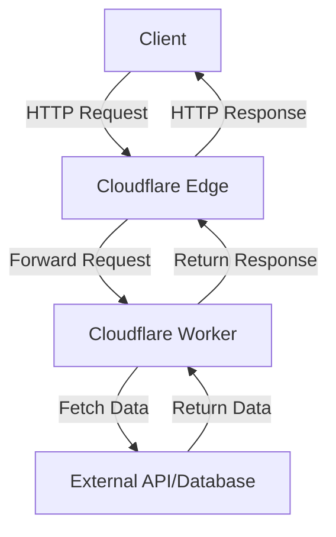

# This is the backend for the app theslope

## Technology stack
Serverless architecture running on Cloudflare
* Cloudflare workers serve the REST api

# Cloudflare Application Architecture



## How to run

## How to test
## How the project was created
### Bootstraping
Check that node is installed
```node --version```

Run the cloudflare installer
```npm create cloudflare@latest```
